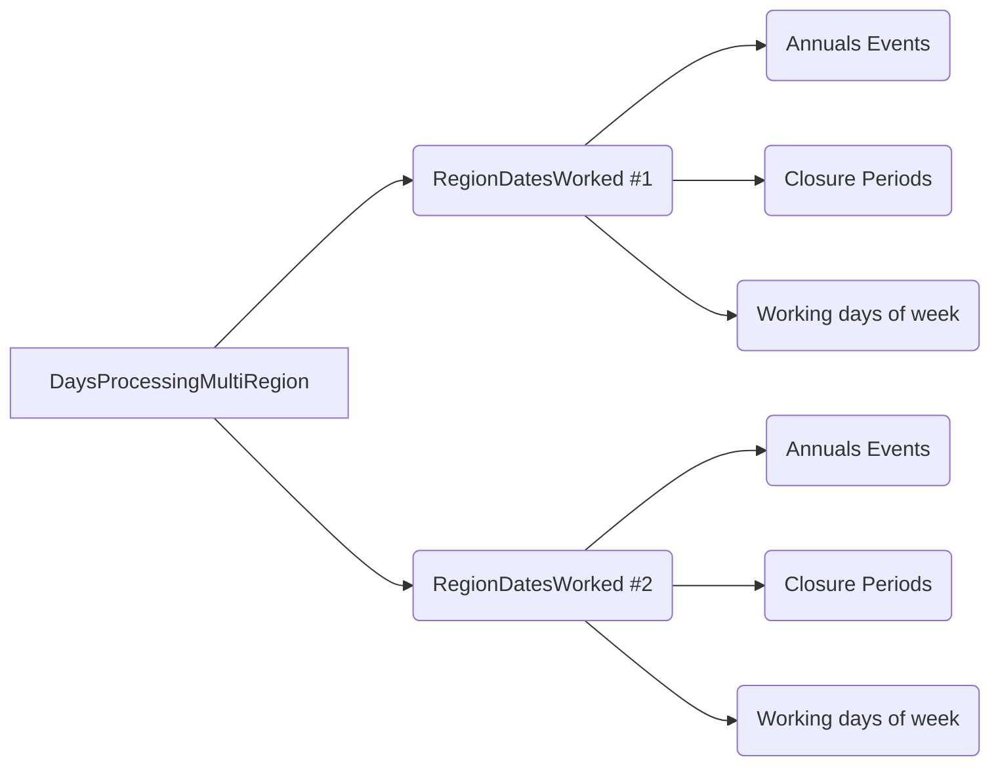
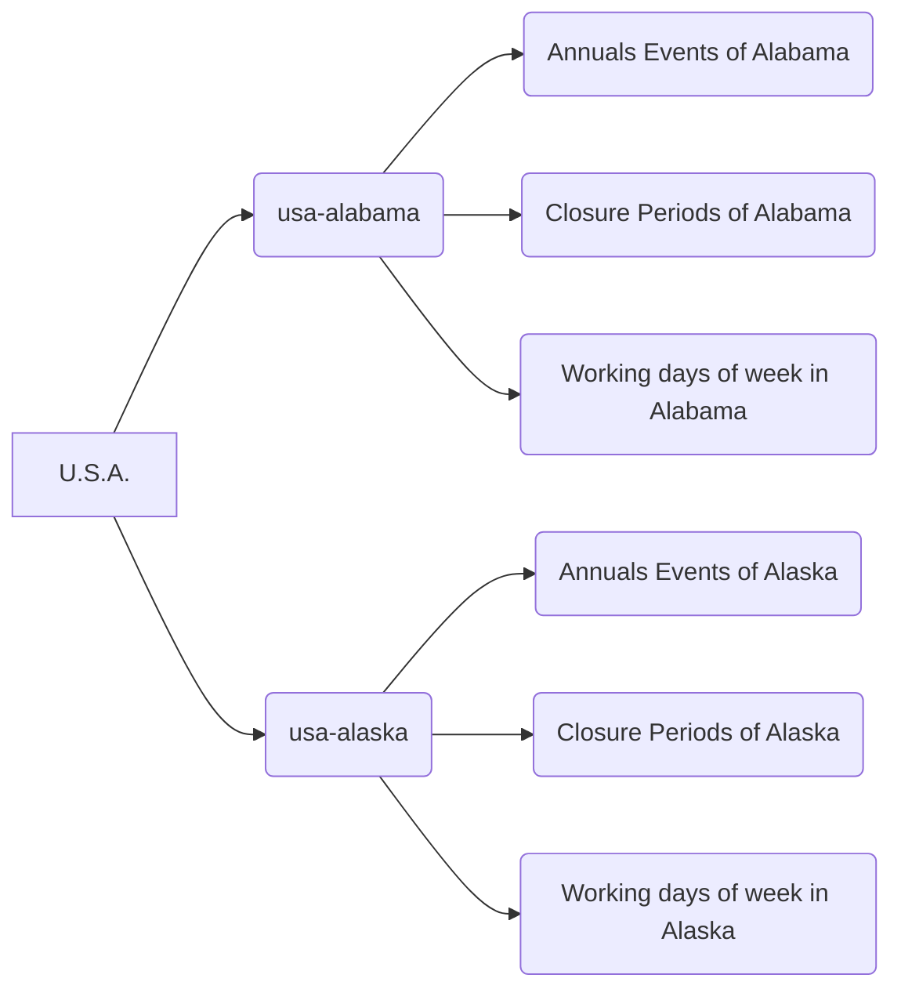

# pbHolidaysComputation
Calculate holidays, closures, and working days with Xojo.

The repository is provided with an example project, allowing you to show how to calculate event dates and how to calculate working days, the next working day after a date, etc.

This is old Real Studio code updated to meet Xojo's API 2.0 requirements. There is still work to be done, particularly regarding documentation... Feel free to share your feedback.
# Table of contents

[Features and generalities](#features)<br>
&nbsp;&nbsp;&nbsp;&nbsp;&nbsp;&nbsp;&nbsp;&nbsp;[Object class diagram](#object-class-diagram)<br>
[Annual Event Classes](#the-4-classes-that-implement-the-annualevent-interface)<br>
&nbsp;&nbsp;&nbsp;&nbsp;&nbsp;&nbsp;&nbsp;&nbsp;[Common methods and properties](#cmap)<br>
&nbsp;&nbsp;&nbsp;&nbsp;&nbsp;&nbsp;&nbsp;&nbsp;&nbsp;&nbsp;&nbsp;&nbsp;&nbsp;&nbsp;[Common properties](#common-properties)<br>
&nbsp;&nbsp;&nbsp;&nbsp;&nbsp;&nbsp;&nbsp;&nbsp;&nbsp;&nbsp;&nbsp;&nbsp;&nbsp;&nbsp;[Common methods](#common-methods)<br>
&nbsp;&nbsp;&nbsp;&nbsp;&nbsp;&nbsp;&nbsp;&nbsp;[AnnualEventFix Class](#annualeventfix-class)<br>
&nbsp;&nbsp;&nbsp;&nbsp;&nbsp;&nbsp;&nbsp;&nbsp;&nbsp;&nbsp;&nbsp;&nbsp;&nbsp;&nbsp;[Properties](#aefproperties)<br>
&nbsp;&nbsp;&nbsp;&nbsp;&nbsp;&nbsp;&nbsp;&nbsp;&nbsp;&nbsp;&nbsp;&nbsp;&nbsp;&nbsp;[Methods](#aefmethods)<br>
&nbsp;&nbsp;&nbsp;&nbsp;&nbsp;&nbsp;&nbsp;&nbsp;[AnnualEventEaster & AnnualEventOrthodoxEaster Classes](#annualeventeaster-and-annualeventorthodoxeaster-classes)<br>
&nbsp;&nbsp;&nbsp;&nbsp;&nbsp;&nbsp;&nbsp;&nbsp;&nbsp;&nbsp;&nbsp;&nbsp;&nbsp;&nbsp;[Properties](#aeeproperties)<br>
&nbsp;&nbsp;&nbsp;&nbsp;&nbsp;&nbsp;&nbsp;&nbsp;&nbsp;&nbsp;&nbsp;&nbsp;&nbsp;&nbsp;[Methods](#aeemethods)<br>
&nbsp;&nbsp;&nbsp;&nbsp;&nbsp;&nbsp;&nbsp;&nbsp;&nbsp;&nbsp;&nbsp;&nbsp;&nbsp;&nbsp;[Constants](#aeeconstants)<br>
&nbsp;&nbsp;&nbsp;&nbsp;&nbsp;&nbsp;&nbsp;&nbsp;&nbsp;&nbsp;&nbsp;&nbsp;&nbsp;&nbsp;[Shared methods](#aeesharedmethods)<br>
&nbsp;&nbsp;&nbsp;&nbsp;[AnnualEventWeekDay Class](#annualeventweekday-class)<br>
&nbsp;&nbsp;&nbsp;&nbsp;&nbsp;&nbsp;&nbsp;&nbsp;&nbsp;&nbsp;&nbsp;&nbsp;&nbsp;&nbsp;[Properties](#aewproperties)<br>
&nbsp;&nbsp;&nbsp;&nbsp;&nbsp;&nbsp;&nbsp;&nbsp;&nbsp;&nbsp;&nbsp;&nbsp;&nbsp;&nbsp;[Methods](#aewmethods)<br>
[ClosurePeriod Class](#closureperiod-class)<br>
&nbsp;&nbsp;&nbsp;&nbsp;&nbsp;&nbsp;&nbsp;&nbsp;[Properties](#cpproperties)<br>
&nbsp;&nbsp;&nbsp;&nbsp;&nbsp;&nbsp;&nbsp;&nbsp;[Methods](#cpmethods)<br>
[RegionDatesWorked Class](#regiondatesworked-class)<br>
&nbsp;&nbsp;&nbsp;&nbsp;&nbsp;&nbsp;&nbsp;&nbsp;[Properties](#rdwproperties)<br>
&nbsp;&nbsp;&nbsp;&nbsp;&nbsp;&nbsp;&nbsp;&nbsp;[Methods](#rdwmethods)<br>
&nbsp;&nbsp;&nbsp;&nbsp;&nbsp;&nbsp;&nbsp;&nbsp;[Shared methods](#dprsharedmethods)<br>
[MultiRegionDatesWorked Class](#multiregiondatesworked-class)<br>
&nbsp;&nbsp;&nbsp;&nbsp;&nbsp;&nbsp;&nbsp;&nbsp;[Properties](#mrdwproperties)<br>
&nbsp;&nbsp;&nbsp;&nbsp;&nbsp;&nbsp;&nbsp;&nbsp;[Methods](#mrdwmethods)<br>
&nbsp;&nbsp;&nbsp;&nbsp;&nbsp;&nbsp;&nbsp;&nbsp;[Shared methods](#mrdwsharedmethods)<br>
# Features
<a id=generalities></a>
The features consist of 8 classes.
#### 4 classes for calculating annual events, such as holidays and commemorations
- AnnualEventFix;
- AnnualEventEaster and AnnualEventOrthodoxEaster;
- AnnualEventWeekDay

These 4 classes implement the **AnnualEvent** interface, allowing them to be used in the same array, for example.

#### A class to indicate periods of closure or holidays, for the class RegionDatesWorked

- ClosurePeriod

#### A class to calculate, for the same region, the working days, closed days, etc. according to holidays, closure periods and working days of the week.

- RegionDatesWorked

#### A class to work with multiple regions, which do not have the same public holidays or vacation periods, for example.

- DaysProcessingMultiRegion

### A class that is used to return the result of certain methods

- DateAndCaption

For example, you can request a list of all public holidays for a given year. An array of this type will be returned, specifying the date and name of the event for each row.

*A final class (dprWorkingWeekDays), which is only there to be a property of the RegionDatesWorked class, is also provided, but is not designed to be used on its own.*
### Object class diagram

This would give, for example, for the United States


[🔝 Back to Table of contents](#table-of-contents)

# The 4 classes that implement the AnnualEvent interface
 These classes are used to manipulate "annual events", such as holidays, celebrations, or events where calculating the date is a bit complicated (like "The Tuesday after the first Monday of November", for the U.S. Election Day).

| Class|For                       
|----------------|------------------------------- |
|[AnnualEventFix](#annualeventfix-class)  |for events whose date is calculated using a fixed month and day (Independence Day, Christmas, etc.)          |
|[AnnualEventEaster](#annualeventeaster-and-annualeventorthodoxeaster-classes) |for events whose date is calculated based on Easter (Mardi Gras, Ash Wednesday, etc.)                      |
|[AnnualEventOrthodoxEaster](#annualeventeaster-and-annualeventorthodoxeaster-classes)|for events whose date is calculated based on Orthodox Easter 
|[AnnualEventWeekDay Class](#annualeventweekday-class)|for events whose date is calculated based on a fixed month and the week number of a weekday (Labor Day, Thanksgiving, etc.) 

<a id="cmap"></a>
### Common methods and properties (implemented by the interface)
Note: An interface defines only methods and not properties. "Properties" are a pair of overloaded methods that simulate real properties.

    Public Sub Caption(assigns s as string) 
    Public Function Caption() As string

### Common properties
| Name|Type                       
|----------------|------------------------------- |
|[Caption](#cpcaption) |String
|[DayOff](#cpdayoff) |Boolean
|[StartOfValidity](#cpsov)  |DateTime
|[EndOfValidity](#cpsov)   |DateTime
|[CycleFirstYear](#cpcfy)|Integer
|[CycleYearDuration](#cpcfy)|Integer
|[Tag](#cptag)|Variant
<a id="cpcaption"></a>
#### Caption 
Type : String

Defines the caption of the event, for example Christmas, Easter, presidential election, etc.
<a id="cpdayoff"></a>
#### DayOff 
Type : Boolean

Defines if it is a non-working day or not (for non-working day the value is true)

The default value is True.
<a id="cpsov"></a>
#### StartOfValidity, EndOfValidity
Type : DateTime

Defines the dates on which the event occurs. For example, we can imagine a new public holiday being created starting next year (or an existing public holiday being discontinued).

The default dates are from January 1st of year 1 to December 31st of year 3999.
<a id="cpcfy"></a>
#### CycleFirstYear, CycleYearDuration
Type : Integer

An event may not occur every year. For example, an election.

If this is the case, you must define the first year and the cycle duration.

**Note :** that if the CycleYearDuration property is less than 2, these parameters are ignored.

The default values ​​are 1900 for CycleFirstYear and 1 for CycleYearDuration.

For example, the cycle for the US presidential election can be defined as follows: 

    Var PresidentialElection As New AnnualEventWeekDay("U.S. Presidential Election",11,2,1) // The first monday of november
    PresidentialElection.NextWeekDay = 3 // Shift to the next tuesday (so the next tuesday after the first monday)
    PresidentialElection.CycleFirstYear = 1792  // The event is not every year
    PresidentialElection.CycleYearDuration = 4
<a id="cptag"></a>
#### Tag
Type : Variant

Variable to put whatever you need in it

[:top: Back to Table of contents](#table-of-contents)
### Common methods
| Name|Parameters|Returned type
|----------------|----------|--------------------- |
|[DateValue](#cmdatevalue)|Year as integer|DateTime
|[Calculate](#cmcalculate)|Year as integer|DateAndCaption
|[TestDate](#cmtestdate)|d as DateTime|Boolean
|[DbRow](#cmdbrow)|RegionIdentifier as Variant = Nil, encoding as TextEncoding = nil|DatabaseRow
|[DefinitionObject](#cmdefobj)||Variant
|[FingerPrint](#cmfp)||String
|[ToString](#cmts)||String


<a id="cmdatevalue"></a>
##### DateValue(Year as integer) as DateTime
Returns the date of the event for the specified year.

If the event did not occur that year, Nil is returned.
The reasons for a Nil value could be that the year falls outside the event's validity period or that the year does not correspond to the cycle.
Hours, minutes, and seconds are all set to 0.

    Var GoodFriday As New AnnualEventEaster("Good Friday",-2)
     // Determine the date for the year 2025
    Var Value2025 as Datetime = GoodFriday.DateValue(2025)
<a id="cmcalculate"></a>
##### Calculate(Year as integer) as DateAndCaption
Returns a DateAndCaption object for the event for the specified year.
The object's date property contains the event date, and the Caption property replicates the event's Caption property.

If the event did not occur that year, Nil is returned.
The reasons for a Nil value could be that the year falls outside the event's validity period or that the year does not correspond to the cycle.
Hours, minutes, and seconds of the Date propertie of the object are all set to 0.
<a id="cmtestdate"></a>
##### TestDate(d as DateTime) as Boolean
Determines if the event occurs on the tested date.
Hours, minutes, and seconds are ignored.

     Var GoodFriday As New AnnualEventEaster("Good Friday",-2)
     Var t as new DateTime(2025,4,18)
     if GoodFriday.TestDate(t) then 
        MessageBox "It's the date of the Good Friday !"
     else
       MessageBox "It's NOT the date of the Good Friday !"
     end
<a id="cmdbrow"></a>
##### DbRow(RegionIdentifier as Variant = Nil, encoding as TextEncoding = nil) as DatabaseRow
Returns a DatabaseRow object.
This allows you to quickly save an event definition to a database.
Example :

    Var LaborDayEvent as New AnnualEventWeekDay("Labor Day",9, 2, 1) // September, the first monday
    Call MyDatabase.AddRow "tdays", LaborDayEvent.dbrow

You can specify the RegionIdentifer for the event if you are working with multiple regions. For example, the date of the commemoration of the abolition of slavery is not the same in the different French regions concerned. This allows you to filter them in the database.

You can also specify a specific encoding, particularly for databases that do not support UTF-8. By default, it is UTF-8.

Below is the SQL (SQLite) code to create a table to store event definitions.
The RegionDatesWorked class provides a method to load events from a RowSet.
<a id="tdays"></a>

    CREATE TABLE "tdays" (
    "id_date"	INTEGER NOT NULL,
    "start"	DATE NOT NULL DEFAULT '1-1-1',
    "end"	DATE NOT NULL DEFAULT '3999-12-31',
    "caption"	TEXT,
    "region"	TEXT,
    "definitiontype"	TEXT NOT NULL,
    "dayoff"	BOOLEAN NOT NULL DEFAULT 1,
    "cyclefirstyear"	INTEGER NOT NULL DEFAULT 1,
    "cycleyearduration"	INTEGER NOT NULL DEFAULT 1,
    "month"	INTEGER NOT NULL DEFAULT 0,
    "day"	INTEGER NOT NULL DEFAULT 0,
    "weekday"	INTEGER NOT NULL DEFAULT 0,
    "rank"	INTEGER NOT NULL DEFAULT 0,
    "adddays"	INTEGER NOT NULL DEFAULT 0,
    "nextweekday"	INTEGER NOT NULL DEFAULT 0,
    "previousweekday"	INTEGER NOT NULL DEFAULT 0,
    "saturdaytofriday"	BOOLEAN NOT NULL DEFAULT 0,
    "sundaytomonday"	BOOLEAN NOT NULL DEFAULT 0,
    "saturdaytomonday"	BOOLEAN NOT NULL DEFAULT 0,
    "fingerprint"	TEXT NOT NULL,
    "alwaysdayshift"	BOOLEAN NOT NULL DEFAULT 0,
    PRIMARY KEY("id_date" AUTOINCREMENT)
    );

<a id="cmdefobj"></a>
##### DefinitionObject() as variant
Returns the object as a variant

Example :
Events() is a array of AnnualEvent

		Var dFix as AnnualEventFix 
		Var dEaster as AnnualEventEaster
		Var dEasterOrthodox as AnnualEventOrthodoxEaster
		Var dWeekDay as AnnualEventWeekDay
    For i as integer = 0 to Events.LastIndex
    
    	Select Case Events(i)
    	
    	Case IsA AnnualEventFix 
      
    			dFix = Events(i).DefinitionObject
      
    	Case IsA AnnualEventEaster
    	  
    	   dEaster = Events(i).DefinitionObject
      
    	Case IsA AnnualEventOrthodoxEaster
          
		   dEasterOrthodox = Events(i).DefinitionObject
     
       Case IsA AnnualEventWeekDay
     
	      dWeekDay =  Events(i).DefinitionObject
      
    End  Select
    
    Next i
<a id="cmfp"></a>
##### FingerPrint() as string
Returns a value calculated based on the nature of the event and the properties, except for the "Caption" and "Tag" properties.
This function can be used to find duplicates in AnnualEvent objects.

    Var VictoriaDay As New AnnualEventFix("Victoria Day ou Fête des patriotes",5,25) // May, 25th
    VictoriaDay.AlwaysPreviousWeekDay = 2 // Previous Monday, even if the calculation falls on a Monday
    MessageBox VictoriaDay.FingerPrint

This code return "F|0001-01-01|3999-12-31|15|25|0|0|-2|0|0"
<a id="cmts"></a>
##### ToString() as string
This function can be used to store an AnnualEvent object as a string, particularly for use in a database field.
The "Caption" property is Base64 encoded. The "Tag" property is not included in the export.

    Var VictoriaDay As New AnnualEventFix("Victoria Day ou Fête des patriotes",5,25) // May, 25th
    VictoriaDay.AlwaysPreviousWeekDay = 2 // Previous Monday, even if the calculation falls on a Monday
    MessageBox VictoriaDay.ToString

This code return "F|VmljdG9yaWEgRGF5IG91IEbDqnRlIGRlcyBwYXRyaW90ZXM=|0001-01-01|3999-12-31|15|25|0|0|-2|0|0"

**Note:** You can create an AnnualEvent object from a value generated by ToString using the shared FromString method of each AnnualEvent object.

[🔝 Back to Table of contents](#table-of-contents)
## AnnualEventFix Class
In addition to the [properties](#common-properties) and [methods](#common-methods) common to the interface, here are the properties specific to this class.
<a id="aefproperties"></a>
### Properties 
| Name|Type                       
|----------------|------------------------------- |
|[Month](#aefmonth) |Integer
|[Day](#aefmonth) |Integer
|[MondayIfSunday](#aefmifs)  |Boolean
|[FridayIfSaturday](#aeffif)   |Boolean
|[NextWeekDay](#aefnwd)|Integer
|[PreviousWeekDay](#aefnwd)|Integer
|[AlwaysNextWeekDay](#aefnwd)|Integer
|[AlwaysPreviousWeekDay](#aefnwd)|Integer
|[AddDays](#aefadddays)|Integer


<a id="aefmonth"></a>
##### Month, Day
Type : Integer

These two values ​​define the month and day of the event each year.

    Var dFix as AnnualEventFix
    // Bastille Day
    dFix.month = 7
    dFix.day = 14
<a id="aefmifs"></a>
##### MondayIfSunday
Type : Boolean

Determines whether the event should be postponed to Monday if it takes place on a Sunday.

    Var dFix as AnnualEventFix
    // Independence day
    dFix.month = 7
    dFix.day = 4
    dFix.MondayIfSunday = True

***Note :*** The property can be associated with FridayIfSaturday

<a id="aeffifs"></a>
##### FridayIfSaturday
Type : Boolean

Determines whether the event should be moved to the previous Friday if it takes place on a Saturday.

    Var dFix as AnnualEventFix
    // Independence day
    dFix.month = 7
    dFix.day = 4
    dFix.FridayIfSaturday = True

***Note :***  The property can be associated with MondayIfSunday

    Var dFix as AnnualEventFix
    // Independence day
    dFix.month = 7
    dFix.day = 4
    // Never a weekend :-)
    dFix.FridayIfSaturday = True
    dFix.MondayIfSunday = True
<a id="aefnwd"></a>
##### NextWeekDay, PreviousWeekDay, AlwaysNextWeekDay, AlwaysPreviousWeekDay
Type : Integer

Determines whether the day will be shifted to the corresponding day of the following week day (or the previous one)

Use NextWeekDay/PreviousWeekDat if shifting is only necessary if the calculation does not fall on the requested day of the week.

Use AlwaysNextWeekDay/AlwaysPreviousWeekDay if shifting is ALWAYS necessary, even if the calculation falls on the correct day of the week (in this case, it's a one-week shift).
For example, in Canada, Victoria Day is ALWAYS shifted to the Monday before May 25th, even if May 25th is a Monday (This is the case for 2026).

The value is the same as the DayOfWeek property of the DateTime class. 
The value less that 1 indicates that there will be no offset
 
    // Victoria Day ou Fête des patriotes
    Var dFixedDay As New AnnualEventFix
    dFixedDay.Month = 5
    dFixedDay.Day = 25
    dFixedDay.AlwaysPreviousWeekDay = 2
<a id="aefadddays"></a>
##### AddDays
Type : Integer

Shifts the event by the specified number of days. Accepts negative values.
The value less that 0 indicates that there will be no offset

For example, imagine a holiday that falls on the day after February 28th.

    // Fun fact: there is a one in 1506 chance of being born on February 29th.
    Var dFixedDay As New AnnualEventFix
    dFixedDay.Caption = "The birthday of people born on February 29th"
    dFixedDay.Month = 2
    dFixedDay.Day = 28
    dFixedDay.AddDays = 1
The calculation will give March 1st except for leap years where it will give February 29th.

#### :warning: Important note on the combination and order of the shifts
The calculation function will first consider the MondayIfSunday and FridayIfSaturday properties, which are cumulative. If these properties are used, it will stop there and ignore any other offsets.
Otherwise, it will apply only ONE of the following conditions in the order below:

 1. AlwaysPreviousWeekDay 
 2. AlwaysNextWeekDay 
 3. PreviousWeekDay
 4. NextWeekDay
 5. AddDays

[🔝 Back to Table of contents](#table-of-contents)

<a id="aefmethods"></a>
### Methods
| Name|Parameters|Returned type
|----------------|----------|--------------------- |
|[Constructor](#aefconstructor1)|lCaption as string = "", lMonth as Integer = 1, lDay as Integer = 1, lFridayIfSaturday as Boolean = False, lMondayIfSunday as Boolean = False
|[Constructor](#aefconstructor2)|copy as AnnualEventFix|
|[Constructor](#aefconstructor3)|a as AnnualEvent|
<a id="aefconstructor1"></a>
##### Constructor(lCaption as string = "", lMonth as Integer = 1, lDay as Integer = 1, lFridayIfSaturday as Boolean = False, lMondayIfSunday as Boolean = False)
Creates a new object AnnualEventFix  whose properties are defined in the method arguments.

    Var dFixedDay As New AnnualEventFix("Día de la Independencia",9,16) // Mexico
<a id="aefconstructor2"></a>
##### Constructor(copy as AnnualEventFix)
Creates a new object AnnualEventFix whose properties are the same as the **copy** object passed (duplication).

    Var dFixedDay As New AnnualEventFix("Día de la Independencia",9,16) // Mexico
    Var dDupli as New AnnualEventFix(dFixedDay)
<a id="aefconstructor3"></a>
##### Constructor(a as AnnualEvent)
Creates a new object AnnualEventFix whose properties are the same as the **copy** object passed (duplication).
If the AnnualEvent is not a AnnualEventFix then a InvalidArgumentException is raised.

[🔝 Back to Table of contents](#table-of-contents)

## AnnualEventEaster and AnnualEventOrthodoxEaster Classes

In addition to the [properties](#common-properties) and [methods](#common-methods) common to the interface, here is one property specific to this class.
The only difference between the AnnualEventOrthodoxEaster class and the AnnualEventEaster class is the algorithm.

Note that the date calculated by AnnualEventOrthodoxEaster is the date of the event in the Gregorian calendar.
<a id="aeeproperties"></a>
### Properties 
| Name|Type                       
|----------------|------------------------------- |
|[DeltaEaster](#aeedelta) |Integer
<a id="aeedelta"></a>
##### DeltaEster
Type : Integer

The number of days to add or subtract from the date of Easter to calculate the date. If 0, it is Easter Sunday.

[🔝 Back to Table of contents](#table-of-contents)
<a id="aeeconstants"></a>
#### Constants
A number of constants are included with this class.

For example, AnnualEventEaster.AshWednesday equals -46.
Since some holidays have multiple names, you may have several constants with the same value.

**Note :** Despite multiple checks, errors may still exist in the values ​​or names.

[🔝 Back to Table of contents](#table-of-contents)

<a id="aeemethods"></a>
### Methods
| Name|Parameters|Returned type
|----------------|----------|--------------------- |
|[Constructor](#aeeconstructor1)|lCaption as string = "", lDeltaEaster as Integer = 0
|[Constructor](#aeeconstructor2)|copy as AnnualEventEaster|
|[Constructor](#aeeconstructor3)|a as AnnualEvent|
<a id="aeeconstructor1"></a>
##### Constructor(lCaption as string = "", lDeltaEaster as Integer = 0)
  Creates a new object AnnualEventEaster (or AnnualEventOrthodoxEaster) whose properties are defined in the method arguments.

```
Var dEasterDay As New AnnualEventEaster("Palm Sunday",-7)
```
<a id="aeeconstructor2"></a>
##### Constructor(copy as AnnualEventEaster )
Creates a new object AnnualEventEaster whose properties are the same as the **copy** object passed (duplication).

```
Var dEasterDay As New AnnualEventEaster("Palm Sunday",-7)
Var dDupli as New AnnualEventEaster(dEasterDay )
```
<a id="aeeconstructor3"></a>
##### Constructor(a as AnnualEvent)

Creates a new object AnnualEventEaster whose properties are the same as the "a" object passed (duplication).  
If the AnnualEvent is not a AnnualEventEaster then a InvalidArgumentException is raised.
<a id=aeesharedmethods></a>
### Shared methods
##### Easter(year as integer) as DateTime
##### OrthodoxEaster(year as integer) as DateTime
Returns the date of Easter Sunday for the requested year.

    Var Easter Sunday as DateTime = AnnualEventEaster.Easter(2025)

[🔝 Back to Table of contents](#table-of-contents)

## AnnualEventWeekDay Class
In addition to the [properties](#common-properties) and [methods](#common-methods) common to the interface, here are properties specific to this class.
<a id="aewproperties"></a>
### Properties 
| Name|Type                       
|----------------|------------------------------- |
|[Month](#aewmonth) |Integer
|[WeekDay](#aewmonth) |Integer
|[Rank](#aewmonth)  |Integer
|[NextWeekDay](#aewnwd)   |Integer
|[PreviousWeekDay](#aewnwd)|Integer
|[AddDays](#aewad)|Integer
<a id="aewmonth"></a>
##### Month, WeekDay, Rank
Type : Integer

Use these three properties to define the event date.

For the third Thursday of February, for example, the values ​​are:

    dWeekDay.Month = 2 // February
    dWeekDay.WeekDay = 5 // Thursday
    dWeekDay.Rank = 3 // 3rd week

To indicate the last week (without knowing if it will be the 4th or 5th), use Rank = 6
<a id="aewnwd"></a>
##### NextWeekDay, PreviousWeekDay
Type : Integer

Determines whether the day will be shifted to the corresponding day of the following week (or the previous one)

Use NextWeekDay/PreviousWeekDay if shifting is only necessary if the calculation does not fall on the requested day of the week.
The value is the same as the DayOfWeek property of the DateTime class. 
The value less that 1 indicates that there will be no offset

    // U.S. Presidential Election (First example of calculation)
    Var dWeekDay As New AnnualEventWeekDay("Presidential Election",11,2,1) // First Monday of November
    dWeekDay.NextWeekDay = 3 // The Tuesday following the first Monday in November 
    dWeekDay.CycleFirstYear = 1848  // The event is not every year
    dWeekDay.CycleYearDuration = 4
<a id="aewad"></a>
##### AddDays
Type : Integer

Shifts the event by the specified number of days. Accepts negative values.
The value less that 0 indicates that there will be no offset


    // U.S. Presidential Election (Second example of calculation)
    Var dWeekDay As New AnnualEventWeekDay("Presidential Election",11,2,1) // First Monday of November
    dWeekDay.AddDays = 1 // The day following the first Monday in November (so a Tuesday)
    dWeekDay.CycleFirstYear = 1848  // The event is not every year
    dWeekDay.CycleYearDuration = 4


#### :warning: Important note on the combination and order of the shifts
The algorithm will apply only ONE of the following conditions in the order below:
 1. PreviousWeekDay  
 2. NextWeekDay
 3. AddDays

[🔝 Back to Table of contents](#table-of-contents)
<a id="aewmethods"></a>
### Methods
| Name|Parameters|Returned type
|----------------|----------|--------------------- |
|[Constructor](#aewconstructor1)|lCaption as string = "", lMonth as Integer = 1, lWeekDay as Integer = 1, lRank as Integer = 1
|[Constructor](#aewconstructor2)|copy as AnnualEventWeekDay|
|[Constructor](#aewconstructor3)|a as AnnualEvent|
<a id="aewconstructor1"></a>
##### Constructor(lCaption as string = "", lMonth as Integer = 1, lWeekDay as Integer = 1, lRank as Integer = 1)
 Creates a new object AnnualEventWeekDay whose properties are defined in the method arguments.

```
Var dWeekDay As New AnnualEventWeekDay("Thanksgiving Day",11,5,4)
// "Thanksgiving Day" => Caption
// November (11) => Month
// Thursday (5) => WeekDay
// The 4th (4) => Rank
```
<a id="aewconstructor2"></a>
##### Constructor(copy as AnnualEventWeekDay )

Creates a new object AnnualEventWeekDay whose properties are the same as the **copy** object passed (duplication).

```
Var dWeekDay As New AnnualEventWeekDay("Thanksgiving Day ",11,5,4)
Var dDupli as New AnnualEventWeekDay(dWeekDay)
```
<a id="aewconstructor3"></a>
##### Constructor(a as AnnualEvent)

Creates a new object AnnualEventWeekDay whose properties are the same as the "a" object passed (duplication).  
If the AnnualEvent is not a AnnualEventWeekDay then a InvalidArgumentException is raised.

[🔝 Back to Table of contents](#table-of-contents)

## ClosurePeriod Class
This class is used to define closure or vacation periods.

Its main purpose is to add it to the ClosurePeriods array of a RegionDatesWorked class.
<a id="cpproperties"></a>
### Properties
| Name|Type                       
|----------------|------------------------------- |
|[Caption](#cpcaption) |Integer
|[FirstDay](#cpfirstday) |Integer
|[LastDay](#cpfirstday)  |Integer
<a id="cpcaption"></a>
##### Caption
Type : string

Defines the caption of the period.
<a id="cpfirstday"></a>
##### FirstDay, LastDay
Type : DateTime

These define the first and last days of the period.

Note that when you assign these values, the first day is automatically set to 00:00:00 and the last day to 23:59:59.

[🔝 Back to Table of contents](#table-of-contents)

<a id="cpmethods"></a>
### Methods
| Name|Parameters|Returned type
|----------------|----------|--------------------- |
|[Constructor](#cpconstructor1)|lFirstDay as DateTime = Nil, lLastDay as DateTime = Nil, lCaption as string = ""
|[Constructor](#cpconstructor2)|copy as ClosurePeriod|
|[Duration](#cpduration)||Integer
|[IsIncluded](#cpinclued)|lDate as DateTime|Booelan
<a id="cpconstructor1"></a>
##### Constructor(lFirstDay as DateTime = Nil, lLastDay as DateTime = Nil, lCaption as string = "")
Creates a new object ClosurePeriods whose properties are defined in the method arguments.

    Var SummerHolidays as new  ClosurePeriod(New DateTime(2025, 6,8), New DateTime(2025, 8,31), "Summer Break")
<a id="cpconstructor2"></a>
##### Constructor(copy as ClosurePeriod )
Creates a new object ClosurePeriod whose properties are the same as the **copy** object passed (duplication).

```
Var SummerHolidays as new ClosurePeriod(New DateTime(2025,6,8), New DateTime(2025,8,31), "Summer Break")
Var dDupli as New ClosurePeriod(SummerHolidays)
```
<a id="cpduration"></a>
##### Duration as integer
Returns the duration in days of the period
<a id="cpinclued"></a>
##### IsIncluded(lDate as DateTime) as Boolean
Returns True if the Date is included in the period.

    Var SummerHolidays as new  ClosurePeriod(New DateTime(2025, 6,8), New DateTime(2025, 8,31), "Summer Break")
    Var dTest as new DateTime(2025,8,1)
    if SummerHolidays.IsIncluded(dtTest) then
	    MessageBox "It's during the holidays!"
    else
	    MessageBox "It's not during the holidays"
    end

[🔝 Back to Table of contents](#table-of-contents)

## RegionDatesWorked Class

This class allows you to manage closure periods, non-working events, and working or non-working days of the week.
By combining these three elements, it helps you calculate the list of working days, the list of non-working days, the next working day, etc.
The class has four properties for this:

 -  An array of the class AnnualEvent
 -  An array of the class ClosurePeriod
 -  A WorkingWeekDays object, which allows you to specify which days of the week are worked
 - A RegionIdentifier property (type variant), to distinguish the object (for example "usa-florida"), if you are    working with multiple regions.
<a id=rdwproperties></a>
### Properties
| Name|Type                       
|----------------|------------------------------- |
|[Identifier](#rdwidentifier) |Variant
|[AnnualEvents()](#rdwannualevents) |Array of AnnualEvent
|[ClosurePeriods()](#rdwclosureperiods) |Array of ClosurePeriod
|[WorkingWeekDay](#rdwwwd)  |dprWorkingWeekDays
|[Tag](#rdwtag)|Variant

<a id="rdwidentifier"></a>
##### Identifier
Type : Variant
Allows you to give an identification to your region, for example the name of a state, a region, the number of a prefecture, etc.

<a id="rdwannualevents"></a>
##### AnnualEvents()

Type : AnnualEvent

This array contains all the annual events in the region.
For example, for the District of Columbia :

    Var r as new RegionDatesWorked("DC")
    
    // https://edpm.dc.gov/chapter/12/#section-1220
    
    Var df as New AnnualEventFix("Inauguration Day", 1, 20, False, True)
    df.CycleFirstYear = 1849
    df.CycleYearDuration = 4
    r.AnnualEvents.Add df
    
    r.AnnualEvents.Add New AnnualEventFix("New Year's Day", 1, 1,  True, True) // January, 1st
    r.AnnualEvents.Add New AnnualEventFix("Independence Day", 7,4,  True, True) // July, 4
    r.AnnualEvents.Add New AnnualEventFix("Veterans Day", 11,11,  True, True) // November, 11
    r.AnnualEvents.Add New AnnualEventFix("Christmas",12,25,  True, True) // December, 25
    r.AnnualEvents.Add New AnnualEventWeekDay("Birthday of Martin Luther King, Jr.", 1,2,3) // January, Monday, The Third
    r.AnnualEvents.Add New AnnualEventWeekDay("Washington's Birthday", 2,2,3) // Frebruary, Monday, The Third
    r.AnnualEvents.Add New AnnualEventWeekDay("Memorial Day", 5, 2, 6) // May, the last monday
    r.AnnualEvents.Add New AnnualEventWeekDay("Labor Day",9, 2, 1) // September, the first monday
    r.AnnualEvents.Add New AnnualEventWeekDay("Columbus Day",10, 2, 2) // October, the second monday
    r.AnnualEvents.Add New AnnualEventWeekDay("Thanksgiving",11, 5, 4) // November, the 4th thursday
Another example, for the Wallonie, region of Belgium    

    Var r as new RegionDatesWorked("belgium-wallonie")
    r.AnnualEvents.Add New AnnualEventFix("Premier janvier", 1, 1)
    r.AnnualEvents.Add New AnnualEventFix("Fête du travail", 5, 1)
    r.AnnualEvents.Add New AnnualEventFix("Fête Nationale", 7, 21)
    r.AnnualEvents.Add New AnnualEventFix("Assomption", 8, 15)
        
    r.AnnualEvents.Add New AnnualEventFix("Toussaint", 11, 1)
    r.AnnualEvents.Add New AnnualEventFix("Armistice 1918", 11, 11)
    r.AnnualEvents.Add New AnnualEventFix("Noël", 12, 25)
        
    r.AnnualEvents.Add New AnnualEventEaster("Lundi de Pâques", 1)
    r.AnnualEvents.Add New AnnualEventEaster("Ascension", 39)
    r.AnnualEvents.Add New AnnualEventEaster("Lundi de Pentecôte", 50)
   
    // If you work for a public service
    r.AnnualEvents.Add New AnnualEventFix("Fête de la Fédération Wallonie-Bruxelles", 9,27)
    r.AnnualEvents.Add New AnnualEventFix("Fête des morts", 11, 2)
    r.AnnualEvents.Add New AnnualEventFix("Jour de la Dynastie", 11, 15)
    r.AnnualEvents.Add New AnnualEventFix("Deuxième jour de Noël", 12, 26)
<a id="rdwclosureperiods"></a>
##### ClosurePeriods()
Type : ClosurePeriod

This array contains all the ClosurePeriod objects for the region.

For example, for school holidays in the District of Columbia (if your business is related to the school system).

    Var r as new RegionDatesWorked("DC")
    // https://washingtonparent.com/dc-public-school-calendar-2025-2026/
    
    r.ClosurePeriods.Add New ClosurePeriod(New DateTime(2025,11,26), New DateTime(2025,11,30), "Thanksiving Break")
    r.ClosurePeriods.Add New ClosurePeriod(New DateTime(2025,12,20), New DateTime(2026,1,4), "Winter Break")
    r.ClosurePeriods.Add New ClosurePeriod(New DateTime(2026,4,11), New DateTime(2026,4,19), "Spring Break")
    r.ClosurePeriods.Add New ClosurePeriod(New DateTime(2026,6,18), New DateTime(2026,8,16), "Summer Break") // Not sure for the 8/16/2026
<a id="rdwwwd"></a>
##### WorkingWeekDays()
Type : dprWorkingWeekDays

Use this property to define the days of the week that are usually worked.
By default, only Saturday and Sunday are non-working days.

    Var r as new RegionDatesWorked("DC")
    r.WorkingWeekDays.WorkingSaturday = True // In my business, we works Saturday
    // The same setting, but indicating the day number of the week, to be used in a For...Next loop for example.
    r.WorkingWeekDays.WorkingDay(7) = True // In my business, we works Saturday

<a id="rdwtag"></a>
##### Tag
Type : Variant

Variable to put whatever you need in it.

[🔝 Back to Table of contents](#table-of-contents)

<a id=rdwmethods></a>
### Methods
| Name|Parameters|Returned type
|----------------|----------|--------------------- |
|[Constructor](#rdwconstructor1)|lIdentifier as variant = Nil
|[Constructor](#rdwconstructor2)|copy as RegionDatesWorked, NewIdentifier as Variant = Nil|
|[BusinnessDays](#rdwbdays)|starting as DateTime, ending as DateTime|DateTime()
|[BusinnessDays](#rdwbdays)|Year as integer|DateTime()
|[IsInClosurePeriod](#rdwcpm)|d as DateTime|Boolean
|[IsInClosurePeriodCaption](#rdwcpmcaption)|d as DateTime|String
|[IsInClosurePeriodObject](#rdwcpmobject)|d as DateTime|ClosurePeriod
|[CountBusinessDays](#rdwcountbusinnessdays)|Date1 as DateTime, Date2 as DateTime|Integer
|[CountNonWorkingDays](#rdwcountnonworkingsdays)|Date1 as DateTime, Date2 as DateTime|Integer
|[IsAnnualEvent](#rdwisannualevent)|d as DateTime, OnlyIfDayOff as Boolan = False|Boolean
|[IsAnnualEventCaption](#rdwisannualevent)|d as DateTime, OnlyIfDayOff as Boolan = False|String
|[IsAnnualEventDateAndCaption](#rdwisannualevent)|d as DateTime, OnlyIfDayOff as Boolan = False|DateAndCaption
|[IsAnnualEventObject](#rdwisannualevent)|d as DateTime, OnlyIfDayOff as Boolan = False|AnnualEvent
|[IsAnnualEventDateAndCaption](#rdwisannualevent)|d as DateTime, OnlyIfDayOff as Boolan = False|DateAndCaption
|[IsAnnualEventDateAndRegion](#rdwisannualevent)|d as DateTime, OnlyIfDayOff as Boolan = False|Variant
|[IsWorkingDay](#rdwisworkingday)|d as DateTime|Boolean
|[ListOfAnnualEvents](#rdwlistofannualevents)|Starting as DateTime, Ending as DateTime, OnlyDayOff as Boolean = False, IncludeSaturday as Boolean = True, IncludeSunday as Boolean = True, IncludeMonday as Boolean = True, IncludeTuesday as Boolean = True, IncludeWednesday as Boolean = True, IncludeThursday as Boolean = True, IncludeFriday as Boolean = True|DateAndCaption()
|[ListOfAnnualEvents](#rdwlistofannualevents)|Year as integer, OnlyDayOff as Boolean = False, IncludeSaturday as Boolean = True, IncludeSunday as Boolean = True, IncludeMonday as Boolean = True, IncludeTuesday as Boolean = True, IncludeWednesday as Boolean = True, IncludeThursday as Boolean = True, IncludeFriday as Boolean = True|DateAndCaption()
[LoadClosurePeriodsFromRowSet](#rdwloadingcp)|rs as RowSet, Encoding as TextEncoding = Nil|
[LoadingAnnualEventsFromRowSet](#rdwloadingae)|rs as RowSet, Encoding as TextEncoding = Nil|
[LoadWeekDaysFromRowSet](#rdwloadingwd)|rs as RowSet, Encoding as TextEncoding = Nil|
[NextBusinessDay / PreviousBusinessDay](#rdwnbd)|d as DateTime, Number as integer = 1|DateTime
[NextNonWorkingDay / PreviousNonWorkingDay](#rdwnnwd)|d as DateTime, Number as integer = 1|DateTime
[NonWorkingDayReasonCaption](#rdwnnwdr)|d as DateTime|String
[NonWorkingDayReasonType](#rdwnnwdr)|d as DateTime|Integer
[NonWorkingDays](#rdwnnwds)|starting as DateTime, ending as DateTime|DateTime()
[NonWorkingDays](#rdwnnwds)|year as integer|DateTime()
[NonWorkingDaysDateAndCaption](#rdwnnwds)|starting as DateTime, ending as DateTime|DateAndCaption()
[NonWorkingDaysDateAndCaption](#rdwnnwds)|year as integer|DateAndCaption()
<a id=rdwconstructor1></a>
##### Constructor (lIdentifier as variant)
Create a new object RegionDatesWorked and assign the Identifier property

    Var r as new RegionDatesWorked("DC")
<a id=rdwconstructor2></a>
##### Constructor (copy as RegionDatesWorked, NewIdentifier as Variant = Nil)
Create a new object RegionDatesWorked whose properties are the same as the **copy** object passed (duplication), and assign the Identifier property

    Var rDC as new RegionDatesWorked("DC")
    Var MySchool as new RegionDatesWorked(rDC, "My Fabulous School")
<a id=rdwbdays></a>
##### BusinnessDays(starting as DateTime, ending as DateTime) as DateTime()
##### BusinnessDays(Year as integer) as DateTime()
Returns an array of DateTime objects, corresponding to each open day, based on the specified working days of the week, closure periods, and public holidays.
The calculation is performed either between two dates or over a year.
All dates are set to 00:00:00
<a id=rdwcpm></a>
##### IsInClosurePeriod(d as DateTime) as Boolean
Returns True if the date is included in at least one closure period.
<a id=rdwcpmcaption></a>
##### IsInClosurePeriodCaption(d as DateTime) as Boolean
Returns the caption of the period, if the date is included in at least one closure period (return the caption of the first period found in the array).
<a id=rdwcpmobject></a>
##### IsInClosurePeriodObject(d as DateTime) as ClosurePeriod
Returns ClosurePeriod object, if the date is included in at least one closure period (return the first period found in the array).
<a id=rdwcountbusinnessdays></a>
##### CountBusinessDays(Date1 as datetime, Date2 as datetime) as integer
Returns the number of working days corresponding to each opening day, based on the specified weekdays, closure periods, and public holidays.
If Date1 and Date2 are on the same day and the date is a working day, then 1 will be returned, otherwise 0.
<a id=rdwcountnonworkingsdays></a>
##### CountNonWorkingDays(Date1 as datetime, Date2 as datetime) as integer
Returns the number of non-working days corresponding to each day off, based on the specified weekdays, closure periods, and public holidays.
If Date1 and Date2 are on the same day and the date is a non-working day, then 1 will be returned, otherwise 0.
<a id=rdwisannualevent></a>
##### IsAnnualEvent(d as DateTime, OnlyIfDayOff as Boolean = False)  as boolean
##### IsAnnualEventObject(d as DateTime, OnlyIfDayOff as Boolean = False)  as AnnualEvent
##### IsAnnualEventDateAndCaption(d as DateTime, OnlyIfDayOff as Boolean = False) as DateAndCaption
##### IsAnnualEventCaption(d as DateTime, OnlyIfDayOff as Boolean = False) as String
##### IsAnnualEventRegion(d as DateTime, OnlyIfDayOff as Boolean = False) as Variant

The methods test if d is a day of an event.
If True:

 - IsAnnualEvent returns True. If no match is found, it returns False.
 - IsAnnualEventObject returns a AnnualEvent object interface.  If no match is found, it returns Nil.  
 - IsAnnualEventDateAndCaption returns a DateAndCaption object that contains the date, the event caption, and the region identifier. If no match is found, it returns Nil.   
- IsAnnualEventCaption returns a string contains the caption of annual event. If no match is found, it returns a empty string.
-  IsAnnualEventRegion returns the region Identifier (this is used when looping through multiple regions to determine which region has a public holiday). If no match is found, it returns Nil.

In this example, r is a RegionDatesWorked object, for the District of Columbia (see above for the code to add holidays)

    Var dTest as New DateTime(2024,11,11) 
    Var AE as AnnualEvent = r.IsAnnualEventObject(dTest)
    If AE <> Nil then
        	Select Case AE
    	
    	Case IsA AnnualEventFix 
      
    			MessageBox "Event Fix : " + AE.Caption
      
    	Case IsA AnnualEventEaster
    	  
    	   MessageBox "Event based on Easter : " + AE.Caption
      
    	Case IsA AnnualEventOrthodoxEaster
          
		   MessageBox "Event based on Orthodox Easter : " + AE.Caption
     
       Case IsA AnnualEventWeekDay
     
	      MessageBox "Event based on weekday and then week number : " + AE.Caption
          End  Select
    
    End If 
<a id=rdwisworkingday></a>
##### IsWorkingDay(d as DateTime) as Boolean
Returns True if the date is a working day, depending on the specified working days, closing periods and public holidays.

In this example, r is a RegionDatesWorked object, for the District of Columbia (see above for the code to add holidays)

    Var d as DateTime = DateTime.Now()
    if r.IsWorkingDay(d) then MessageBox "Today, it's a working day !"
<a id=rdwlistofannualevents></a>
##### ListOfAnnualEvents(Starting as DateTime, Ending as DateTime, OnlyDayOff as boolean = False, IncludeSaturday as Boolean = True, IncludeSunday as Boolean = True, IncludeMonday as Boolean = True, IncludeTuesday as Boolean = True, IncludeWednesday as Boolean = True, IncludeThursday as Boolean = True, IncludeFriday as Boolean = True) as DateAndCaption
##### ListOfAnnualEvents(Year as integer, OnlyDayOff as boolean = False, IncludeSaturday as Boolean = True, IncludeSunday as Boolean = True, IncludeMonday as Boolean = True, IncludeTuesday as Boolean = True, IncludeWednesday as Boolean = True, IncludeThursday as Boolean = True, IncludeFriday as Boolean = True) as DateAndCaption
Returns an array of DateAndCaption objects, listing all events between the two dates (or over the chosen year).

You can filter to show only events that are holidays (OnlyDayOff = True). By default, OnlyDayOff = False.

You can also choose whether or not to include events that take place on a specific day of the week in the results. By default, all days of the week are included.

In this example, r is a RegionDatesWorked object, for the District of Columbia (see above for the code to add holidays)

    //  All events for 2025, only holydays (non working event) and unless they fall on Sunday
    Var Holidays() as DateAndCaption = r.ListOfAnnualEvents(2025, True, True, False)
<a id=rdwloadingcp></a>
##### LoadClosurePeriodsFromRowSet(rs as RowSet, Encoding as TextEncoding = Nil) 
This method works like the shared method [ClosurePeriodsFromRowSet](#dprsharedclosureperiodsfromrowset).

It directly adds the periods to the ClosurePeriods array.

The Inditifier filter is applied by default.
<a id=rdwloadingae></a>
##### LoadEventsFromRowSet(rs as RowSet, Encoding as TextEncoding = Nil)
This method works like the shared method [AnnualEventsFromRowSet](#dprsharedannualeventsfromrowset).

It directly adds the periods to the AnnualEvents array.

The Inditifier filter is applied by default.
<a id=rdwloadingwd></a>
##### LoadWeekDaysFromRowSet(rs as RowSet, Encoding as TextEncoding = Nil) 
Loads the working (or non-working) days of the week from a RowSet object. The first row whose "region" column matches the Identifier property of the RegionDatesWorked class is loaded. Subsequent rows are ignored.
```
Try 
   rs = TheDb.SelectSQL("Select * FROM tregions_weekdays WHERE region = ?1, r.identifier.stringvalue.lowercase) 
Catch err As DataBaseException 
	MessageBox "(" + Err.ErrorNumber.ToString + ") " + err.Message 
	Exit Sub 
End Try 
r.LoadWeekDaysFromRowSet(rs)
```
The SQL definition of a database table is below (for SQLite), with the expected column names.

    CREATE TABLE "tregions_weekdays" (
    	"id_region"	INTEGER NOT NULL,
    	"region"	TEXT NOT NULL UNIQUE,
    	"sunday"	BOOLEAN NOT NULL DEFAULT 0,
    	"monday"	BOOLEAN NOT NULL DEFAULT 1,
    	"tuesday"	BOOLEAN NOT NULL DEFAULT 1,
    	"wednesday"	BOOLEAN NOT NULL DEFAULT 1,
    	"thursday"	BOOLEAN NOT NULL DEFAULT 1,
    	"friday"	BOOLEAN NOT NULL DEFAULT 1,
    	"saturday"	BOOLEAN NOT NULL DEFAULT 0,
    	PRIMARY KEY("id_region" AUTOINCREMENT)
    );
<a id=rdwnbd></a>
##### NextBusinessDay(d as datetime, number as integer = 1) as DateTime
##### PreviousBusinessDay(d as datetime, number as integer = 1) as DateTime
Returns the next open day (1), or the second (2), ... depending on the parameter number. The function takes into account working days of the week, closing periods, and events.
AnnualEvents with the DayOff property = True are non-working days.
Negative values ​​give the same result as the PreviousBusinessDay function. Similarly, negative values ​​for the PreviousBusinessDay function give the same result as for the NextBusinessDay function.

In this example, r is a RegionDatesWorked object, for the District of Columbia (see above for the code to add holidays)

    Var d as DateTime = DateTime.Now()
    Var DeliveryDay = r.NextBusinessDay(d, 4) // Four business days for a delivery
<a id=rdwnnwd></a>
##### NextNonWorkingDay(d as datetime, number as integer = 1) as DateTime
##### PreviousNonWorkingDay(d as datetime, number as integer = 1) as DateTime
Returns the next non-working day (1), or the second (2), ... depending on the parameter number. The function takes into account working days of the week, closure periods, and events.
AnnualEvents with the DayOff property = True are non-working days.
Negative values ​​give the same result as the PreviousNonWorkingDay function. Similarly, negative values ​​for the PreviousNonWorkingDay function give the same result as for the NextNonWorkingDay function.

<a id=rdwnnwdr></a>
##### NonWorkingDayReasonCaption(d as DateTime) as string
##### NonWorkingDayReasonType(d as DateTime) as integer

ForNonWorkingDayReasonCaption, if the date is a non-working day, returns, according to this order of priority:

 - the name of the day of the week (if that's why it's a non-working day)    
 - the caption of the closure period (if the date falls within that period)
  - the caption of the annual event (if the date corresponds to an event)
  - If it's a working day, return an empty string

For NonWorkingDayReasonType, if the date is a non-working day, return, according to this order of priority:

 - 1, if that's why it's a non-working day in the week    
 - 2, if the date falls in a closure period
  - 3, if the date corresponds to an event 
  - 0, if it's a working day
<a id=rdwnnwds></a>
##### NonWorkingDays(starting as DateTime, ending as DateTime) as DateTime()
##### NonWorkingDays(year as integer) as DateTime()
##### NonWorkingDaysDateAndCaption(starting as DateTime, ending as DateTime) as DateAndCaption()
##### NonWorkingDaysDateAndCaption(year as integer) as DateAndCaption()
Returns an array of DateTime objects, corresponding to each non-working day, based on the specified working days of the week, closing periods, and public holidays.

The calculation can be requested between two dates or over a year.

All dates are initialized to 00:00:00.

NonWorkingDaysDateAndCaption returns an array of DateAndCaption objects.
For the methods NonWorkingDaysDateAndCaption, the caption property, according to this order of priority, is :

- the name of the day of the week (if that's why it's a non-working day)

- the caption for the closing period (if the date falls within that period)

- the caption for the annual event (if the date corresponds to an event)

- If it's a working day, return an empty string

[🔝 Back to Table of contents](#table-of-contents)
<a id=dprsharedmethods></a>
### Shared methods
| Name|Parameters|Returned type
|----------------|----------|--------------------- |
|[AnnualEventsBelgium](#dprsharedmethodsbelgium)|Region as Belgium = Belgium.NationauxEnFrancais, PublicService as Boolean = True|AnnualEvents()
|[AnnualEventsFrance](#dprsharedmethodsfrance)|Region as France = France.General|AnnualEvents()
|[AnnualEventsUSA](#dprsharedmethodsusa)|State as USA = USA.Federal|AnnualEvents()
|[AnnualEventsFromRowSet](#dprsharedannualeventsfromrowset)|rs as RowSet, Identifier as Variant = Nil, Encoding as TextEncoding = Nil|AnnualEvents()
|[ClosurePeriodsFromRowSet](#dprsharedclosureperiodsfromrowset)|rs as RowSet, Identifier as Variant = Nil, Encoding as TextEncoding = Nil|ClosurePeriod()
<a id=dprsharedmethodsbelgium></a>
##### AnnualEventsBelgium(Region as RegionDatesWorked.Belgium = Belgium.NationauxEnFrancais, PublicService as Boolean = True)
Returns an array of AnnualEvent objects containing the holidays of Belgium. The Belgium enumeration allows you to choose the region. For common holidays (national holidays), the enumeration contains 3 sets, each named in one of the three national languages.

    Var Bruxelles as  New RegionDatesWorked("belgium-bruxelles")
    Bruxelles.AnnualEvents = RegionDatesWorked.AnnualEventsBelgium(Belgium.BruxellesCapitale)

Finally, the PublicService argument allows you to specify certain holidays observed only by public services.
<a id=dprsharedmethodsfrance></a>
##### AnnualEventsFrance(Region as RegionDatesWorked.France = France.Regional) as AnnualEvents
Returns an array of AnnualEvent objects containing the French holidays. The France enumeration allows you to choose the region.

    Var Martinique as  New RegionDatesWorked("france-martinique")
    Martinique.AnnualEvents = RegionDatesWorked.AnnualEventsFrance(France.Martinique)
<a id=dprsharedmethodsusa></a>
##### AnnualEventsUSA(State as RegionDatesWorked.USA= USA.Federal) as AnnualEvents
Returns an array of AnnualEvent objects containing the U.S.A holidays. The USA enumeration allows you to choose the state.
**Note:** The references used to create this list are commented out in the source code. Generally, they are the state law texts.

The research is far from finished (I'm following the alphabetical order and am currently up to the District of Columbia).
Please feel free to point out any errors, omissions, or subtleties.

    Var DC as  New RegionDatesWorked("dc")
    DC.AnnualEvents = RegionDatesWorked.AnnualEventsUSA(USA.DistrictOfColumbia)
<a id=dprsharedannualeventsfromrowset></a>
##### AnnualEventsFromRowSet(rs as RowSet, Identifier as Variant = Nil, Encoding as TextEncoding = Nil) as AnnualEvents
Returns an array of AnnualEvent objects from the rs object.

The Identifier argument allows you to keep only the rows in the rowset where the Region column is equal to Identifier. However, it is recommended to filter directly in the SQL query.

The encoding argument allows conversion, if necessary, from a rowset not encoded in UTF-8 to UTF-8. You must then specify the original encoding.

The SQL definition of a database table is given [here](#tdays) (for SQLite), with the expected column names.

In this example, r is a RegionDatesWorked object, for the District of Columbia (see above for the code to add holidays). TheDb is a DataBase object.

    Try
      rs =TheDb.SelectSQL("Select * FROM tdays WHERE region = ?1, r.identifier.stringvalue.lowercase)
    Catch err As DataBaseException
      MessageBox "(" + Err.ErrorNumber.ToString + ") " + err.Message
      Exit Sub
    End Try
    r.AnnualEvents = RegionDatesWorked.LoadEventsFromRowSet(rs, r.identifier)

<a id=dprsharedclosureperiodsfromrowset></a>
#### ClosurePeriodsFromRowSet(rs as RowSet, Identifier as variant = nil, Encoding as TextEncoding = Nil) as ClosurePeriod()
Returns an array of ClosurePeriod objects from the rs object.

The Identifier argument allows you to keep only the rows in the rowset where the Region column is equal to Identifier. However, it is recommended to filter directly in the SQL query.

The encoding argument allows conversion, if necessary, from a rowset not encoded in UTF-8 to UTF-8. You must then specify the original encoding.

The SQL definition of a database table is given here (for SQLite), with the expected column names.

    Try 
    	rs =TheDb.SelectSQL("Select * FROM tclosureperiods WHERE region = ?1, r.identifier.stringvalue.lowercase) 
    	Catch err As DataBaseException 
    	MessageBox "(" + Err.ErrorNumber.ToString + ") " + err.Message 
    	Exit Sub 
    End Try 
    r.AnnualEvents = RegionDatesWorked.LoadEve   ntsFromRowSet(rs, r.identifier)

For closure periods, the SQL definition of a database table is given below.

    CREATE TABLE "tclosureperiods" (
    	"id_period"	INTEGER,
    	"caption"	INTEGER NOT NULL,
    	"firstday"	DATE NOT NULL,
    	"lastday"	DATE NOT NULL,
    	"region"	TEXT NOT NULL,
    	PRIMARY KEY("id_period" AUTOINCREMENT)
    )

[🔝 Back to Table of contents](#table-of-contents)
## MultiRegionDatesWorked Class
This class allows you to manipulate several RegionDatesWorked classes.

The methods are mostly the same.

For example, the IsWorkingDay function will return True only if it's a working day for ALL regions.

Each RegionDatesWorked object has an Enabled property, which controls whether it is processed by the methods of that class.

    // The following region will not be processed by the methods
    MyRegionDatesWorked.Regions(3).Enabled = False

<a id=mrdwproperties></a>
### Properties
| Name|Type                       
|----------------|------------------------------- |
|[Regions()](#mrdwregions) |Array of RegionDatesWorked
|[Tag](#mrdwtag)|Variant
<a id=mrdwregions></a>
##### Regions()
Type :  Array of RegionDatesWorked

Array of RegionDatesWorked objects that will be processed by the methods of the class

    Var Belgium as new MultiRegionDatesWorked
    Belgium.Regions.Add new RegionDatesWorked("belgium-bruxelles")
    Belgium.Regions.Add new RegionDatesWorked("belgium-wallonie")
    Belgium.Regions.Add new RegionDatesWorked("belgium-vlaanderen")
    Belgium.Regions.Add new RegionDatesWorked("belgium-deutschsprachige-gemeinschaft")

<a id=mrdwtag></a>
##### Tag
Type : Variant

Variable to put whatever you need in it.

[🔝 Back to Table of contents](#table-of-contents)

<a id=mrdwmethods></a>
### Methods
| Name|Parameters|Returned type
|----------------|----------|--------------------- |
|[Constructor](#mrdwconstructor)||
|[Constructor](#mrdwconstructor)|copy as MultiRegionDatesWorked|
|[BusinnessDays](#mrdwconstructor)|starting as DateTime, ending as DateTime|DateTime()
|[BusinnessDays](#mrdwconstructor)|Year as integer|DateTime()
|[CountBusinnessDays](#mrdwcbd)|Date1 as DateTime, Date2 as DateTime|Integer
|[CountNonWorkingDays](#mrdwcnwd)|Date1 as DateTime, Date2 as DateTime|Integer
|[IsAnnualEvent](#mrdwiae)|d as DateTime, OnlyIfDayOff as Boolean = False|Boolean
|[IsInClosurePeridod](#mrdwicp)|d as DateTime|Boolean
|[IsWorkingWeekDay](#mrdwiwwd)|d as DateTime|Boolean
|[IsWorkingDay](#mrdwiwd)|d as DateTime|Boolean
|[ListOfAnnualEvents](#mrdwloae)|Starting as DateTime, Ending as DateTime, OnlyDayOff as Boolean, IncludeSaturday as Boolean = True, IncludeSunday as Boolean = True, IncludeMonday as Boolean = True, IncludeTuesday as Boolean = True, IncludeWednesday as Boolean = True, IncludeThursday as Boolean = True, IncludeFriday as Boolean = True|DateAndCaption()
|[ListOfAnnualEvents](#mrdwloae)|Year as integer, OnlyDayOff as Boolean, IncludeSaturday as Boolean = True, IncludeSunday as Boolean = True, IncludeMonday as Boolean = True, IncludeTuesday as Boolean = True, IncludeWednesday as Boolean = True, IncludeThursday as Boolean = True, IncludeFriday as Boolean = True|DateAndCaption()
|[ListOfRegions](#mrdwlor)||Variant()
[NextBusinessDay / PreviousBusinessDay](#mrdwnbd)|d as DateTime, Number as integer = 1|DateTime
|[NonWorkingDays](#mrdwnwd)|starting as DateTime, ending as DateTime|DateTime()
|[NonWorkingDays](#mrdwnwd)|Year as integer|DateTime()
<a id=mrdwconstructor></a>
##### Constructor
##### Constructor(copy as MultiRegionDatesWorked)
Create a new object MultiRegionDatesWorked whose propertie Regions() are the same as the **copy** object passed (duplication). Each RegionDatesWorked object is duplicated.
<a id=mrdwbusinessdays></a>
##### BusinnessDays(starting as DateTime, ending as DateTime) as DateTime()
##### BusinnessDays(Year as integer) as DateTime()

Returns an array of DateTime objects, corresponding to each opening day, based on the specified weekdays, closing periods, and holidays. The day must be a working day for ALL regions.

The calculation is performed either between two dates or over a year.

All dates are initialized to 00:00:00.

    // All the days that will be open for the year 2025
    Var OpenDays() as DateTime = Belgium.BusinessDays(2025)
<a id=mrdwcbd></a>
##### CountBusinessDays(Date1 as datetime, Date2 as datetime) as integer
Returns the number of working days corresponding to each opening day, based on the specified weekdays, closure periods, and public holidays.
If Date1 and Date2 are on the same day and the date is a working day, then 1 will be returned, otherwise 0.
 

    // number of working days for the year 2025
    Var d1 as new DateTime(2025,1,1)
    Var d2 as new DateTime(2025,12,31)
    Var NbOpenDays() as Integer = Belgium.CountBusinessDays(d1,d2)

<a id=mrdwcnwd></a>
##### CountNonWorkingDays(Date1 as datetime, Date2 as datetime) as integer
Returns the number of non-working days corresponding to each day off, based on the specified weekdays, closure periods, and public holidays.
If Date1 and Date2 are on the same day and the date is a non-working day, then 1 will be returned, otherwise 0.

    // number of non working days for the year 2025
    Var d1 as new DateTime(2025,1,1)
    Var d2 as new DateTime(2025,12,31)
    Var NbDayOff() as Integer = Belgium.CountNonWorkingDays(d1,d2)
<a id=mrdwiae></a>
##### IsAnnualEvent(d as DateTime, OnlyIfDayOff as Boolean = False) as Boolean
This method tests if the date is an event day for AT LEAST one region. If so, it returns True. If there are no events for any region, it returns False.
<a id=mrdwicp></a>
##### IsInClosurePeriod(d as DateTime) as Boolean
This method tests whether the date falls within a closure period in at least one region. If so, it returns True. If it does not fall within any closure period in any region, it returns False.
<a id=mrdwiwwd></a>
##### IsWorkingWeekDay(d as DateTime) as Boolean
This method tests whether the date is a day of the week usually worked in ALL regions.
<a id=mrdwiwd></a>
##### IsWorkingDay(d as DateTime) as Boolean
This method tests whether the date is a working day in ALL regions.
<a id=mrdwloae></a>
##### ListOfAnnualEvents(Starting as DateTime, Ending as DateTime, OnlyDayOff as boolean = False, IncludeSaturday as Boolean = True, IncludeSunday as Boolean = True, IncludeMonday as Boolean = True, IncludeTuesday as Boolean = True, IncludeWednesday as Boolean = True, IncludeThursday as Boolean = True, IncludeFriday as Boolean = True) as DateAndCaption
##### ListOfAnnualEvents(Year as integer, OnlyDayOff as boolean = False, IncludeSaturday as Boolean = True, IncludeSunday as Boolean = True, IncludeMonday as Boolean = True, IncludeTuesday as Boolean = True, IncludeWednesday as Boolean = True, IncludeThursday as Boolean = True, IncludeFriday as Boolean = True) as DateAndCaption

Returns an array of DateAndCaption objects listing all events between the two dates (or within the selected year) for ALL regions.

The same holiday may appear multiple times if several regions observe it.

You can filter the results to show only events that are holidays (OnlyDayOff = True). By default, OnlyDayOff = False.

You can also choose whether or not to include events that occur on a specific day of the week. By default, all days of the week are included.
    
    //  All events for 2025, only holydays (non working event) and unless they fall on Sunday, for Belgium
        Var Holidays() as DateAndCaption = Belgium.ListOfAnnualEvents(2025, True, True, False)
<a id=mrdwlor></a>
##### ListOfRegions() as Variant()
Returns an array containing the Identifier property of each region.

    Var identifiers() as Variant = Belgium.ListOfRegions
<a id=mrdwnbd></a>
##### NextBusinessDay(d as DateTime, Number as integer) as DateTime
##### PreviousBusinessDay(d as DateTime, Number as integer) as DateTime
Returns the next open day (1), or the second (2), ... depending on the parameter number. The function takes into account working days of the week, closing periods, and events.
AnnualEvents with the DayOff property = True are non-working days.

Negative values ​​give the same result as the PreviousBusinessDay function. Similarly, negative values ​​for the PreviousBusinessDay function give the same result as for the NextBusinessDay function.
Returns the next business day (1), or the second (2), etc., depending on the parameter number. The function takes into 
account weekdays, closure periods, and events.

The business day is the business day COMMON TO ALL REGIONS.

In this example, Belgium is a MultiRegionDatesWorked object

    Var d as DateTime = DateTime.Now()
    Var DeliveryDay = Belgium.NextBusinessDay(d,4) // Four business days for a delivery
<a id=mrdwnwd></a>
##### NonWorkingDays(starting as DateTime, ending as DateTime) as Number
##### NonWorkingDays(year as integer) as Number

Returns an array of DateTime objects, corresponding to each non-working day, based on the specified working days of the week, closing periods, and public holidays. A day is considered a non-working day if it is a non-working day in AT LEAST one region.

The calculation can be performed over a period between two dates or over a year.

All dates are initialized to 00:00:00.
<a id=mrdwsharedmethods></a>
### Shared Methods
| Name|Parameters|Returned type
|----------------|----------|--------------------- |
|[LoadAnnualEventsFromRowSet](#mrdwsharedlae)|regions() as RegionDatesWorked, rs as RowSet, Encoding as TextEncoding = Nil|
|[LoadClosurePeriodsFromRowSet](#mrdwsharedlae)|regions() as RegionDatesWorked, rs as RowSet, Encoding as TextEncoding = Nil|
|[LoadWeekDaysFromRowSet](#mrdwsharedlae)|regions() as RegionDatesWorked, rs as RowSet, Encoding as TextEncoding = Nil|
[LoadRegions](https://stackedit.io/app#mrdwsharedlae)|rs as RowSet, Encoding as TextEncoding = Nil|

<a id=mrdwsharedlae></a>
##### LoadAnnualEventsFromRowSet(regions() as RegionDatesWorked, rs as RowSet, Encoding as TextEncoding = Nil)
##### LoadClosurePeriodsFromRowSet(regions() as RegionDatesWorked, rs as RowSet, Encoding as TextEncoding = Nil)
##### LoadWeekDaysFromRowSet(regions() as RegionDatesWorked, rs as RowSet, Encoding as TextEncoding = Nil)
Assigns the closure periods, week days or the annual events read from the rs object to the different RegionDatesWorked objects in the Regions() array.
The link is established between the "region" column and the "Identifier" property.

##### LoadRegions(rs as RowSet, Encoding as TextEncoding = Nil) as RegionDatesWorked()
Returns an array of RegionDatesWorked objects read from the rs object.

    Try
      rs = MyDataBase.SelectSQL("Select * FROM tregions ORDER BY identifier")
    Catch err As DataBaseException
      MessageBox "(" + Err.ErrorNumber.ToString + ") " + err.Message
      Break
      Exit Sub
    End Try

The SQL definition of a database table is given here (for SQLite), with the expected column names.

    CREATE TABLE "tregions" (
    	"id_region"	INTEGER NOT NULL,
    	"identifier"	TEXT NOT NULL UNIQUE,
    	PRIMARY KEY("id_region")
    )

[🔝 Back to Table of contents](#table-of-contents)

pbHolidaysComputation

Calculate holidays, closures, and working days with Xojo.

The repository is provided with an example project, allowing you to show how to calculate event dates and how to calculate working days, the next working day after a date, etc.

This is old Real Studio code updated to meet Xojo’s API 2.0 requirements. There is still work to be done, particularly regarding documentation… Feel free to share your feedback.
Table of contents

Features and generalities
        Object class diagram
Annual Event Classes
        Common methods and properties
              Common properties
              Common methods
        AnnualEventFix Class
              Properties
              Methods
        AnnualEventEaster & AnnualEventOrthodoxEaster Classes
              Properties
              Methods
              Constants
              Shared methods
    AnnualEventWeekDay Class
              Properties
              Methods
ClosurePeriod Class
        Properties
        Methods
RegionDatesWorked Class
        Properties
        Methods
        Shared methods
MultiRegionDatesWorked Class
        Properties
        Methods
        Shared methods
Features


The features consist of 8 classes.
4 classes for calculating annual events, such as holidays and commemorations

    AnnualEventFix;
    AnnualEventEaster and AnnualEventOrthodoxEaster;
    AnnualEventWeekDay

These 4 classes implement the AnnualEvent interface, allowing them to be used in the same array, for example.
A class to indicate periods of closure or holidays, for the class RegionDatesWorked

    ClosurePeriod

A class to calculate, for the same region, the working days, closed days, etc. according to holidays, closure periods and working days of the week.

    RegionDatesWorked

A class to work with multiple regions, which do not have the same public holidays or vacation periods, for example.

    DaysProcessingMultiRegion

A class that is used to return the result of certain methods

    DateAndCaption

For example, you can request a list of all public holidays for a given year. An array of this type will be returned, specifying the date and name of the event for each row.

A final class (dprWorkingWeekDays), which is only there to be a property of the RegionDatesWorked class, is also provided, but is not designed to be used on its own.
Object class diagram

DaysProcessingMultiRegion

RegionDatesWorked #1

Annuals Events

Closure Periods

Working days of week

RegionDatesWorked #2

Annuals Events

Closure Periods

Working days of week

This would give, for example, for the United States

U.S.A.

usa-alabama

Annuals Events of Alabama

Closure Periods of Alabama

Working days of week in Alabama

usa-alaska

Annuals Events of Alaska

Closure Periods of Alaska

Working days of week in Alaska

🔝 Back to Table of contents
The 4 classes that implement the AnnualEvent interface

These classes are used to manipulate “annual events”, such as holidays, celebrations, or events where calculating the date is a bit complicated (like “The Tuesday after the first Monday of November”, for the U.S. Election Day).
Class 	For
AnnualEventFix 	for events whose date is calculated using a fixed month and day (Independence Day, Christmas, etc.)
AnnualEventEaster 	for events whose date is calculated based on Easter (Mardi Gras, Ash Wednesday, etc.)
AnnualEventOrthodoxEaster 	for events whose date is calculated based on Orthodox Easter
AnnualEventWeekDay Class 	for events whose date is calculated based on a fixed month and the week number of a weekday (Labor Day, Thanksgiving, etc.)

Common methods and properties (implemented by the interface)

Note: An interface defines only methods and not properties. “Properties” are a pair of overloaded methods that simulate real properties.

Public Sub Caption(assigns s as string) 
Public Function Caption() As string

Common properties
Name 	Type
Caption 	String
DayOff 	Boolean
StartOfValidity 	DateTime
EndOfValidity 	DateTime
CycleFirstYear 	Integer
CycleYearDuration 	Integer
Tag 	Variant

Caption

Type : String

Defines the caption of the event, for example Christmas, Easter, presidential election, etc.
DayOff

Type : Boolean

Defines if it is a non-working day or not (for non-working day the value is true)

The default value is True.
StartOfValidity, EndOfValidity

Type : DateTime

Defines the dates on which the event occurs. For example, we can imagine a new public holiday being created starting next year (or an existing public holiday being discontinued).

The default dates are from January 1st of year 1 to December 31st of year 3999.
CycleFirstYear, CycleYearDuration

Type : Integer

An event may not occur every year. For example, an election.

If this is the case, you must define the first year and the cycle duration.

Note : that if the CycleYearDuration property is less than 2, these parameters are ignored.

The default values ​​are 1900 for CycleFirstYear and 1 for CycleYearDuration.

For example, the cycle for the US presidential election can be defined as follows:

Var PresidentialElection As New AnnualEventWeekDay("U.S. Presidential Election",11,2,1) // The first monday of november
PresidentialElection.NextWeekDay = 3 // Shift to the next tuesday (so the next tuesday after the first monday)
PresidentialElection.CycleFirstYear = 1792  // The event is not every year
PresidentialElection.CycleYearDuration = 4

Tag

Type : Variant

Variable to put whatever you need in it

🔝 Back to Table of contents
Common methods
Name 	Parameters 	Returned type
DateValue 	Year as integer 	DateTime
Calculate 	Year as integer 	DateAndCaption
TestDate 	d as DateTime 	Boolean
DbRow 	RegionIdentifier as Variant = Nil, encoding as TextEncoding = nil 	DatabaseRow
DefinitionObject 		Variant
FingerPrint 		String

DateValue(Year as integer) as DateTime

Returns the date of the event for the specified year.

If the event did not occur that year, Nil is returned.
The reasons for a Nil value could be that the year falls outside the event’s validity period or that the year does not correspond to the cycle.
Hours, minutes, and seconds are all set to 0.

Var GoodFriday As New AnnualEventEaster("Good Friday",-2)
 // Determine the date for the year 2025
Var Value2025 as Datetime = GoodFriday.DateValue(2025)

Calculate(Year as integer) as DateAndCaption

Returns a DateAndCaption object for the event for the specified year.
The object’s date property contains the event date, and the Caption property replicates the event’s Caption property.

If the event did not occur that year, Nil is returned.
The reasons for a Nil value could be that the year falls outside the event’s validity period or that the year does not correspond to the cycle.
Hours, minutes, and seconds of the Date propertie of the object are all set to 0.
TestDate(d as DateTime) as Boolean

Determines if the event occurs on the tested date.
Hours, minutes, and seconds are ignored.

 Var GoodFriday As New AnnualEventEaster("Good Friday",-2)
 Var t as new DateTime(2025,4,18)
 if GoodFriday.TestDate(t) then 
    MessageBox "It's the date of the Good Friday !"
 else
   MessageBox "It's NOT the date of the Good Friday !"
 end

DbRow(RegionIdentifier as Variant = Nil, encoding as TextEncoding = nil) as DatabaseRow

Returns a DatabaseRow object.
This allows you to quickly save an event definition to a database.
Example :

Var LaborDayEvent as New AnnualEventWeekDay("Labor Day",9, 2, 1) // September, the first monday
Call MyDatabase.AddRow "tdays", LaborDayEvent.dbrow

You can specify the RegionIdentifer for the event if you are working with multiple regions. For example, the date of the commemoration of the abolition of slavery is not the same in the different French regions concerned. This allows you to filter them in the database.

You can also specify a specific encoding, particularly for databases that do not support UTF-8. By default, it is UTF-8.

Below is the SQL (SQLite) code to create a table to store event definitions.
The RegionDatesWorked class provides a method to load events from a RowSet.

CREATE TABLE "tdays" (
"id_date"	INTEGER NOT NULL,
"start"	DATE NOT NULL DEFAULT '1-1-1',
"end"	DATE NOT NULL DEFAULT '3999-12-31',
"caption"	TEXT,
"region"	TEXT,
"definitiontype"	TEXT NOT NULL,
"dayoff"	BOOLEAN NOT NULL DEFAULT 1,
"cyclefirstyear"	INTEGER NOT NULL DEFAULT 1,
"cycleyearduration"	INTEGER NOT NULL DEFAULT 1,
"month"	INTEGER NOT NULL DEFAULT 0,
"day"	INTEGER NOT NULL DEFAULT 0,
"weekday"	INTEGER NOT NULL DEFAULT 0,
"rank"	INTEGER NOT NULL DEFAULT 0,
"adddays"	INTEGER NOT NULL DEFAULT 0,
"nextweekday"	INTEGER NOT NULL DEFAULT 0,
"previousweekday"	INTEGER NOT NULL DEFAULT 0,
"saturdaytofriday"	BOOLEAN NOT NULL DEFAULT 0,
"sundaytomonday"	BOOLEAN NOT NULL DEFAULT 0,
"saturdaytomonday"	BOOLEAN NOT NULL DEFAULT 0,
"fingerprint"	TEXT NOT NULL,
"alwaysdayshift"	BOOLEAN NOT NULL DEFAULT 0,
PRIMARY KEY("id_date" AUTOINCREMENT)
);

DefinitionObject() as variant

Returns the object as a variant

Example :
Events() is a array of AnnualEvent

	Var dFix as AnnualEventFix 
	Var dEaster as AnnualEventEaster
	Var dEasterOrthodox as AnnualEventOrthodoxEaster
	Var dWeekDay as AnnualEventWeekDay
For i as integer = 0 to Events.LastIndex

	Select Case Events(i)
	
	Case IsA AnnualEventFix 
  
			dFix = Events(i).DefinitionObject
  
	Case IsA AnnualEventEaster
	  
	   dEaster = Events(i).DefinitionObject
  
	Case IsA AnnualEventOrthodoxEaster
      
	   dEasterOrthodox = Events(i).DefinitionObject
 
   Case IsA AnnualEventWeekDay
 
      dWeekDay =  Events(i).DefinitionObject
  
End  Select

Next i

FingerPrint() as string

Returns a value calculated based on the nature of the event, its parameters, and its validity dates.
The caption and the shift parameters properties is not part of the fingerprint.

Var VictoriaDay As New AnnualEventFix("Victoria Day ou Fête des patriotes",5,25) // May, 25th
VictoriaDay.AlwaysPreviousWeekDay = 2 // Previous Monday, even if the calculation falls on a Monday
MessageBox dFixedDay.FingerPrint

This code return “F05;25;0|0001-01-01|3999-12-31”

🔝 Back to Table of contents
AnnualEventFix Class

In addition to the properties and methods common to the interface, here are the properties specific to this class.
Properties
Name 	Type
Month 	Integer
Day 	Integer
MondayIfSunday 	Boolean
FridayIfSaturday 	Boolean
NextWeekDay 	Integer
PreviousWeekDay 	Integer
AlwaysNextWeekDay 	Integer
AlwaysPreviousWeekDay 	Integer
AddDays 	Integer

Month, Day

Type : Integer

These two values ​​define the month and day of the event each year.

Var dFix as AnnualEventFix
// Bastille Day
dFix.month = 7
dFix.day = 14

MondayIfSunday

Type : Boolean

Determines whether the event should be postponed to Monday if it takes place on a Sunday.

Var dFix as AnnualEventFix
// Independence day
dFix.month = 7
dFix.day = 4
dFix.MondayIfSunday = True

Note : The property can be associated with FridayIfSaturday

FridayIfSaturday

Type : Boolean

Determines whether the event should be moved to the previous Friday if it takes place on a Saturday.

Var dFix as AnnualEventFix
// Independence day
dFix.month = 7
dFix.day = 4
dFix.FridayIfSaturday = True

Note : The property can be associated with MondayIfSunday

Var dFix as AnnualEventFix
// Independence day
dFix.month = 7
dFix.day = 4
// Never a weekend :-)
dFix.FridayIfSaturday = True
dFix.MondayIfSunday = True

NextWeekDay, PreviousWeekDay, AlwaysNextWeekDay, AlwaysPreviousWeekDay

Type : Integer

Determines whether the day will be shifted to the corresponding day of the following week day (or the previous one)

Use NextWeekDay/PreviousWeekDat if shifting is only necessary if the calculation does not fall on the requested day of the week.

Use AlwaysNextWeekDay/AlwaysPreviousWeekDay if shifting is ALWAYS necessary, even if the calculation falls on the correct day of the week (in this case, it’s a one-week shift).
For example, in Canada, Victoria Day is ALWAYS shifted to the Monday before May 25th, even if May 25th is a Monday (This is the case for 2026).

The value is the same as the DayOfWeek property of the DateTime class.
The value less that 1 indicates that there will be no offset

// Victoria Day ou Fête des patriotes
Var dFixedDay As New AnnualEventFix
dFixedDay.Month = 5
dFixedDay.Day = 25
dFixedDay.AlwaysPreviousWeekDay = 2

AddDays

Type : Integer

Shifts the event by the specified number of days. Accepts negative values.
The value less that 0 indicates that there will be no offset

For example, imagine a holiday that falls on the day after February 28th.

// Fun fact: there is a one in 1506 chance of being born on February 29th.
Var dFixedDay As New AnnualEventFix
dFixedDay.Caption = "The birthday of people born on February 29th"
dFixedDay.Month = 2
dFixedDay.Day = 28
dFixedDay.AddDays = 1

The calculation will give March 1st except for leap years where it will give February 29th.
⚠️ Important note on the combination and order of the shifts

The calculation function will first consider the MondayIfSunday and FridayIfSaturday properties, which are cumulative. If these properties are used, it will stop there and ignore any other offsets.
Otherwise, it will apply only ONE of the following conditions in the order below:

    AlwaysPreviousWeekDay
    AlwaysNextWeekDay
    PreviousWeekDay
    NextWeekDay
    AddDays

🔝 Back to Table of contents

Methods
Name 	Parameters 	Returned type
Constructor 	lCaption as string = “”, lMonth as Integer = 1, lDay as Integer = 1, lFridayIfSaturday as Boolean = False, lMondayIfSunday as Boolean = False 	
Constructor 	copy as AnnualEventFix 	
Constructor 	a as AnnualEvent 	

Constructor(lCaption as string = “”, lMonth as Integer = 1, lDay as Integer = 1, lFridayIfSaturday as Boolean = False, lMondayIfSunday as Boolean = False)

Creates a new object AnnualEventFix whose properties are defined in the method arguments.

Var dFixedDay As New AnnualEventFix("Día de la Independencia",9,16) // Mexico

Constructor(copy as AnnualEventFix)

Creates a new object AnnualEventFix whose properties are the same as the copy object passed (duplication).

Var dFixedDay As New AnnualEventFix("Día de la Independencia",9,16) // Mexico
Var dDupli as New AnnualEventFix(dFixedDay)

Constructor(a as AnnualEvent)

Creates a new object AnnualEventFix whose properties are the same as the copy object passed (duplication).
If the AnnualEvent is not a AnnualEventFix then a InvalidArgumentException is raised.

🔝 Back to Table of contents
AnnualEventEaster and AnnualEventOrthodoxEaster Classes

In addition to the properties and methods common to the interface, here is one property specific to this class.
The only difference between the AnnualEventOrthodoxEaster class and the AnnualEventEaster class is the algorithm.

Note that the date calculated by AnnualEventOrthodoxEaster is the date of the event in the Gregorian calendar.
Properties
Name 	Type
DeltaEaster 	Integer

DeltaEster

Type : Integer

The number of days to add or subtract from the date of Easter to calculate the date. If 0, it is Easter Sunday.

🔝 Back to Table of contents
Constants

A number of constants are included with this class.

For example, AnnualEventEaster.AshWednesday equals -46.
Since some holidays have multiple names, you may have several constants with the same value.

Note : Despite multiple checks, errors may still exist in the values ​​or names.

🔝 Back to Table of contents

Methods
Name 	Parameters 	Returned type
Constructor 	lCaption as string = “”, lDeltaEaster as Integer = 0 	
Constructor 	copy as AnnualEventEaster 	
Constructor 	a as AnnualEvent 	

Constructor(lCaption as string = “”, lDeltaEaster as Integer = 0)

Creates a new object AnnualEventEaster (or AnnualEventOrthodoxEaster) whose properties are defined in the method arguments.

Var dEasterDay As New AnnualEventEaster("Palm Sunday",-7)

Constructor(copy as AnnualEventEaster )

Creates a new object AnnualEventEaster whose properties are the same as the copy object passed (duplication).

Var dEasterDay As New AnnualEventEaster("Palm Sunday",-7)
Var dDupli as New AnnualEventEaster(dEasterDay )

Constructor(a as AnnualEvent)

Creates a new object AnnualEventEaster whose properties are the same as the “a” object passed (duplication).
If the AnnualEvent is not a AnnualEventEaster then a InvalidArgumentException is raised.
Shared methods
Easter(year as integer) as DateTime
OrthodoxEaster(year as integer) as DateTime

Returns the date of Easter Sunday for the requested year.

Var Easter Sunday as DateTime = AnnualEventEaster.Easter(2025)

🔝 Back to Table of contents
AnnualEventWeekDay Class

In addition to the properties and methods common to the interface, here are properties specific to this class.
Properties
Name 	Type
Month 	Integer
WeekDay 	Integer
Rank 	Integer
NextWeekDay 	Integer
PreviousWeekDay 	Integer
AddDays 	Integer

Month, WeekDay, Rank

Type : Integer

Use these three properties to define the event date.

For the third Thursday of February, for example, the values ​​are:

dWeekDay.Month = 2 // February
dWeekDay.WeekDay = 5 // Thursday
dWeekDay.Rank = 3 // 3rd week

To indicate the last week (without knowing if it will be the 4th or 5th), use Rank = 6
NextWeekDay, PreviousWeekDay

Type : Integer

Determines whether the day will be shifted to the corresponding day of the following week (or the previous one)

Use NextWeekDay/PreviousWeekDay if shifting is only necessary if the calculation does not fall on the requested day of the week.
The value is the same as the DayOfWeek property of the DateTime class.
The value less that 1 indicates that there will be no offset

// U.S. Presidential Election (First example of calculation)
Var dWeekDay As New AnnualEventWeekDay("Presidential Election",11,2,1) // First Monday of November
dWeekDay.NextWeekDay = 3 // The Tuesday following the first Monday in November 
dWeekDay.CycleFirstYear = 1848  // The event is not every year
dWeekDay.CycleYearDuration = 4

AddDays

Type : Integer

Shifts the event by the specified number of days. Accepts negative values.
The value less that 0 indicates that there will be no offset

// U.S. Presidential Election (Second example of calculation)
Var dWeekDay As New AnnualEventWeekDay("Presidential Election",11,2,1) // First Monday of November
dWeekDay.AddDays = 1 // The day following the first Monday in November (so a Tuesday)
dWeekDay.CycleFirstYear = 1848  // The event is not every year
dWeekDay.CycleYearDuration = 4

⚠️ Important note on the combination and order of the shifts

The algorithm will apply only ONE of the following conditions in the order below:

    PreviousWeekDay
    NextWeekDay
    AddDays

🔝 Back to Table of contents
Methods
Name 	Parameters 	Returned type
Constructor 	lCaption as string = “”, lMonth as Integer = 1, lWeekDay as Integer = 1, lRank as Integer = 1 	
Constructor 	copy as AnnualEventWeekDay 	
Constructor 	a as AnnualEvent 	

Constructor(lCaption as string = “”, lMonth as Integer = 1, lWeekDay as Integer = 1, lRank as Integer = 1)

Creates a new object AnnualEventWeekDay whose properties are defined in the method arguments.

Var dWeekDay As New AnnualEventWeekDay("Thanksgiving Day",11,5,4)
// "Thanksgiving Day" => Caption
// November (11) => Month
// Thursday (5) => WeekDay
// The 4th (4) => Rank

Constructor(copy as AnnualEventWeekDay )

Creates a new object AnnualEventWeekDay whose properties are the same as the copy object passed (duplication).

Var dWeekDay As New AnnualEventWeekDay("Thanksgiving Day ",11,5,4)
Var dDupli as New AnnualEventWeekDay(dWeekDay)

Constructor(a as AnnualEvent)

Creates a new object AnnualEventWeekDay whose properties are the same as the “a” object passed (duplication).
If the AnnualEvent is not a AnnualEventWeekDay then a InvalidArgumentException is raised.

🔝 Back to Table of contents
ClosurePeriod Class

This class is used to define closure or vacation periods.

Its main purpose is to add it to the ClosurePeriods array of a RegionDatesWorked class.
Properties
Name 	Type
Caption 	Integer
FirstDay 	Integer
LastDay 	Integer

Caption

Type : string

Defines the caption of the period.
FirstDay, LastDay

Type : DateTime

These define the first and last days of the period.

Note that when you assign these values, the first day is automatically set to 00:00:00 and the last day to 23:59:59.

🔝 Back to Table of contents

Methods
Name 	Parameters 	Returned type
Constructor 	lFirstDay as DateTime = Nil, lLastDay as DateTime = Nil, lCaption as string = “” 	
Constructor 	copy as ClosurePeriod 	
Duration 		Integer
IsIncluded 	lDate as DateTime 	Booelan

Constructor(lFirstDay as DateTime = Nil, lLastDay as DateTime = Nil, lCaption as string = “”)

Creates a new object ClosurePeriods whose properties are defined in the method arguments.

Var SummerHolidays as new  ClosurePeriod(New DateTime(2025, 6,8), New DateTime(2025, 8,31), "Summer Break")

Constructor(copy as ClosurePeriod )

Creates a new object ClosurePeriod whose properties are the same as the copy object passed (duplication).

Var SummerHolidays as new ClosurePeriod(New DateTime(2025,6,8), New DateTime(2025,8,31), "Summer Break")
Var dDupli as New ClosurePeriod(SummerHolidays)

Duration as integer

Returns the duration in days of the period
IsIncluded(lDate as DateTime) as Boolean

Returns True if the Date is included in the period.

Var SummerHolidays as new  ClosurePeriod(New DateTime(2025, 6,8), New DateTime(2025, 8,31), "Summer Break")
Var dTest as new DateTime(2025,8,1)
if SummerHolidays.IsIncluded(dtTest) then
    MessageBox "It's during the holidays!"
else
    MessageBox "It's not during the holidays"
end

🔝 Back to Table of contents
RegionDatesWorked Class

This class allows you to manage closure periods, non-working events, and working or non-working days of the week.
By combining these three elements, it helps you calculate the list of working days, the list of non-working days, the next working day, etc.
The class has four properties for this:

    An array of the class AnnualEvent
    An array of the class ClosurePeriod
    A WorkingWeekDays object, which allows you to specify which days of the week are worked
    A RegionIdentifier property (type variant), to distinguish the object (for example “usa-florida”), if you are working with multiple regions.

Properties
Name 	Type
Identifier 	Variant
AnnualEvents() 	Array of AnnualEvent
ClosurePeriods() 	Array of ClosurePeriod
WorkingWeekDay 	dprWorkingWeekDays
Tag 	Variant

Identifier

Type : Variant
Allows you to give an identification to your region, for example the name of a state, a region, the number of a prefecture, etc.

AnnualEvents()

Type : AnnualEvent

This array contains all the annual events in the region.
For example, for the District of Columbia :

Var r as new RegionDatesWorked("DC")

// https://edpm.dc.gov/chapter/12/#section-1220

Var df as New AnnualEventFix("Inauguration Day", 1, 20, False, True)
df.CycleFirstYear = 1849
df.CycleYearDuration = 4
r.AnnualEvents.Add df

r.AnnualEvents.Add New AnnualEventFix("New Year's Day", 1, 1,  True, True) // January, 1st
r.AnnualEvents.Add New AnnualEventFix("Independence Day", 7,4,  True, True) // July, 4
r.AnnualEvents.Add New AnnualEventFix("Veterans Day", 11,11,  True, True) // November, 11
r.AnnualEvents.Add New AnnualEventFix("Christmas",12,25,  True, True) // December, 25
r.AnnualEvents.Add New AnnualEventWeekDay("Birthday of Martin Luther King, Jr.", 1,2,3) // January, Monday, The Third
r.AnnualEvents.Add New AnnualEventWeekDay("Washington's Birthday", 2,2,3) // Frebruary, Monday, The Third
r.AnnualEvents.Add New AnnualEventWeekDay("Memorial Day", 5, 2, 6) // May, the last monday
r.AnnualEvents.Add New AnnualEventWeekDay("Labor Day",9, 2, 1) // September, the first monday
r.AnnualEvents.Add New AnnualEventWeekDay("Columbus Day",10, 2, 2) // October, the second monday
r.AnnualEvents.Add New AnnualEventWeekDay("Thanksgiving",11, 5, 4) // November, the 4th thursday

Another example, for the Wallonie, region of Belgium

Var r as new RegionDatesWorked("belgium-wallonie")
r.AnnualEvents.Add New AnnualEventFix("Premier janvier", 1, 1)
r.AnnualEvents.Add New AnnualEventFix("Fête du travail", 5, 1)
r.AnnualEvents.Add New AnnualEventFix("Fête Nationale", 7, 21)
r.AnnualEvents.Add New AnnualEventFix("Assomption", 8, 15)
    
r.AnnualEvents.Add New AnnualEventFix("Toussaint", 11, 1)
r.AnnualEvents.Add New AnnualEventFix("Armistice 1918", 11, 11)
r.AnnualEvents.Add New AnnualEventFix("Noël", 12, 25)
    
r.AnnualEvents.Add New AnnualEventEaster("Lundi de Pâques", 1)
r.AnnualEvents.Add New AnnualEventEaster("Ascension", 39)
r.AnnualEvents.Add New AnnualEventEaster("Lundi de Pentecôte", 50)

// If you work for a public service
r.AnnualEvents.Add New AnnualEventFix("Fête de la Fédération Wallonie-Bruxelles", 9,27)
r.AnnualEvents.Add New AnnualEventFix("Fête des morts", 11, 2)
r.AnnualEvents.Add New AnnualEventFix("Jour de la Dynastie", 11, 15)
r.AnnualEvents.Add New AnnualEventFix("Deuxième jour de Noël", 12, 26)

ClosurePeriods()

Type : ClosurePeriod

This array contains all the ClosurePeriod objects for the region.

For example, for school holidays in the District of Columbia (if your business is related to the school system).

Var r as new RegionDatesWorked("DC")
// https://washingtonparent.com/dc-public-school-calendar-2025-2026/

r.ClosurePeriods.Add New ClosurePeriod(New DateTime(2025,11,26), New DateTime(2025,11,30), "Thanksiving Break")
r.ClosurePeriods.Add New ClosurePeriod(New DateTime(2025,12,20), New DateTime(2026,1,4), "Winter Break")
r.ClosurePeriods.Add New ClosurePeriod(New DateTime(2026,4,11), New DateTime(2026,4,19), "Spring Break")
r.ClosurePeriods.Add New ClosurePeriod(New DateTime(2026,6,18), New DateTime(2026,8,16), "Summer Break") // Not sure for the 8/16/2026

WorkingWeekDays()

Type : dprWorkingWeekDays

Use this property to define the days of the week that are usually worked.
By default, only Saturday and Sunday are non-working days.

Var r as new RegionDatesWorked("DC")
r.WorkingWeekDays.WorkingSaturday = True // In my business, we works Saturday
// The same setting, but indicating the day number of the week, to be used in a For...Next loop for example.
r.WorkingWeekDays.WorkingDay(7) = True // In my business, we works Saturday

Tag

Type : Variant

Variable to put whatever you need in it.

🔝 Back to Table of contents

Methods
Name 	Parameters 	Returned type
Constructor 	lIdentifier as variant = Nil 	
Constructor 	copy as RegionDatesWorked, NewIdentifier as Variant = Nil 	
BusinnessDays 	starting as DateTime, ending as DateTime 	DateTime()
BusinnessDays 	Year as integer 	DateTime()
IsInClosurePeriod 	d as DateTime 	Boolean
IsInClosurePeriodCaption 	d as DateTime 	String
IsInClosurePeriodObject 	d as DateTime 	ClosurePeriod
CountBusinessDays 	Date1 as DateTime, Date2 as DateTime 	Integer
CountNonWorkingDays 	Date1 as DateTime, Date2 as DateTime 	Integer
IsAnnualEvent 	d as DateTime, OnlyIfDayOff as Boolan = False 	Boolean
IsAnnualEventCaption 	d as DateTime, OnlyIfDayOff as Boolan = False 	String
IsAnnualEventDateAndCaption 	d as DateTime, OnlyIfDayOff as Boolan = False 	DateAndCaption
IsAnnualEventObject 	d as DateTime, OnlyIfDayOff as Boolan = False 	AnnualEvent
IsAnnualEventDateAndCaption 	d as DateTime, OnlyIfDayOff as Boolan = False 	DateAndCaption
IsAnnualEventDateAndRegion 	d as DateTime, OnlyIfDayOff as Boolan = False 	Variant
IsWorkingDay 	d as DateTime 	Boolean
ListOfAnnualEvents 	Starting as DateTime, Ending as DateTime, OnlyDayOff as Boolean = False, IncludeSaturday as Boolean = True, IncludeSunday as Boolean = True, IncludeMonday as Boolean = True, IncludeTuesday as Boolean = True, IncludeWednesday as Boolean = True, IncludeThursday as Boolean = True, IncludeFriday as Boolean = True 	DateAndCaption()
ListOfAnnualEvents 	Year as integer, OnlyDayOff as Boolean = False, IncludeSaturday as Boolean = True, IncludeSunday as Boolean = True, IncludeMonday as Boolean = True, IncludeTuesday as Boolean = True, IncludeWednesday as Boolean = True, IncludeThursday as Boolean = True, IncludeFriday as Boolean = True 	DateAndCaption()
LoadClosurePeriodsFromRowSet 	rs as RowSet, Encoding as TextEncoding = Nil 	
LoadingAnnualEventsFromRowSet 	rs as RowSet, Encoding as TextEncoding = Nil 	
LoadWeekDaysFromRowSet 	rs as RowSet, Encoding as TextEncoding = Nil 	
NextBusinessDay / PreviousBusinessDay 	d as DateTime, Number as integer = 1 	DateTime
NextNonWorkingDay / PreviousNonWorkingDay 	d as DateTime, Number as integer = 1 	DateTime
NonWorkingDayReasonCaption 	d as DateTime 	String
NonWorkingDayReasonType 	d as DateTime 	Integer
NonWorkingDays 	starting as DateTime, ending as DateTime 	DateTime()
NonWorkingDays 	year as integer 	DateTime()
NonWorkingDaysDateAndCaption 	starting as DateTime, ending as DateTime 	DateAndCaption()
NonWorkingDaysDateAndCaption 	year as integer 	DateAndCaption()

Constructor (lIdentifier as variant)

Create a new object RegionDatesWorked and assign the Identifier property

Var r as new RegionDatesWorked("DC")

Constructor (copy as RegionDatesWorked, NewIdentifier as Variant = Nil)

Create a new object RegionDatesWorked whose properties are the same as the copy object passed (duplication), and assign the Identifier property

Var rDC as new RegionDatesWorked("DC")
Var MySchool as new RegionDatesWorked(rDC, "My Fabulous School")

BusinnessDays(starting as DateTime, ending as DateTime) as DateTime()
BusinnessDays(Year as integer) as DateTime()

Returns an array of DateTime objects, corresponding to each open day, based on the specified working days of the week, closure periods, and public holidays.
The calculation is performed either between two dates or over a year.
All dates are set to 00:00:00
IsInClosurePeriod(d as DateTime) as Boolean

Returns True if the date is included in at least one closure period.
IsInClosurePeriodCaption(d as DateTime) as Boolean

Returns the caption of the period, if the date is included in at least one closure period (return the caption of the first period found in the array).
IsInClosurePeriodObject(d as DateTime) as ClosurePeriod

Returns ClosurePeriod object, if the date is included in at least one closure period (return the first period found in the array).
CountBusinessDays(Date1 as datetime, Date2 as datetime) as integer

Returns the number of working days corresponding to each opening day, based on the specified weekdays, closure periods, and public holidays.
If Date1 and Date2 are on the same day and the date is a working day, then 1 will be returned, otherwise 0.
CountNonWorkingDays(Date1 as datetime, Date2 as datetime) as integer

Returns the number of non-working days corresponding to each day off, based on the specified weekdays, closure periods, and public holidays.
If Date1 and Date2 are on the same day and the date is a non-working day, then 1 will be returned, otherwise 0.
IsAnnualEvent(d as DateTime, OnlyIfDayOff as Boolean = False) as boolean
IsAnnualEventObject(d as DateTime, OnlyIfDayOff as Boolean = False) as AnnualEvent
IsAnnualEventDateAndCaption(d as DateTime, OnlyIfDayOff as Boolean = False) as DateAndCaption
IsAnnualEventCaption(d as DateTime, OnlyIfDayOff as Boolean = False) as String
IsAnnualEventRegion(d as DateTime, OnlyIfDayOff as Boolean = False) as Variant

The methods test if d is a day of an event.
If True:

    IsAnnualEvent returns True. If no match is found, it returns False.
    IsAnnualEventObject returns a AnnualEvent object interface. If no match is found, it returns Nil.
    IsAnnualEventDateAndCaption returns a DateAndCaption object that contains the date, the event caption, and the region identifier. If no match is found, it returns Nil.
    IsAnnualEventCaption returns a string contains the caption of annual event. If no match is found, it returns a empty string.
    IsAnnualEventRegion returns the region Identifier (this is used when looping through multiple regions to determine which region has a public holiday). If no match is found, it returns Nil.

In this example, r is a RegionDatesWorked object, for the District of Columbia (see above for the code to add holidays)

Var dTest as New DateTime(2024,11,11) 
Var AE as AnnualEvent = r.IsAnnualEventObject(dTest)
If AE <> Nil then
    	Select Case AE
	
	Case IsA AnnualEventFix 
  
			MessageBox "Event Fix : " + AE.Caption
  
	Case IsA AnnualEventEaster
	  
	   MessageBox "Event based on Easter : " + AE.Caption
  
	Case IsA AnnualEventOrthodoxEaster
      
	   MessageBox "Event based on Orthodox Easter : " + AE.Caption
 
   Case IsA AnnualEventWeekDay
 
      MessageBox "Event based on weekday and then week number : " + AE.Caption
      End  Select

End If 

IsWorkingDay(d as DateTime) as Boolean

Returns True if the date is a working day, depending on the specified working days, closing periods and public holidays.

In this example, r is a RegionDatesWorked object, for the District of Columbia (see above for the code to add holidays)

Var d as DateTime = DateTime.Now()
if r.IsWorkingDay(d) then MessageBox "Today, it's a working day !"

ListOfAnnualEvents(Starting as DateTime, Ending as DateTime, OnlyDayOff as boolean = False, IncludeSaturday as Boolean = True, IncludeSunday as Boolean = True, IncludeMonday as Boolean = True, IncludeTuesday as Boolean = True, IncludeWednesday as Boolean = True, IncludeThursday as Boolean = True, IncludeFriday as Boolean = True) as DateAndCaption
ListOfAnnualEvents(Year as integer, OnlyDayOff as boolean = False, IncludeSaturday as Boolean = True, IncludeSunday as Boolean = True, IncludeMonday as Boolean = True, IncludeTuesday as Boolean = True, IncludeWednesday as Boolean = True, IncludeThursday as Boolean = True, IncludeFriday as Boolean = True) as DateAndCaption

Returns an array of DateAndCaption objects, listing all events between the two dates (or over the chosen year).

You can filter to show only events that are holidays (OnlyDayOff = True). By default, OnlyDayOff = False.

You can also choose whether or not to include events that take place on a specific day of the week in the results. By default, all days of the week are included.

In this example, r is a RegionDatesWorked object, for the District of Columbia (see above for the code to add holidays)

//  All events for 2025, only holydays (non working event) and unless they fall on Sunday
Var Holidays() as DateAndCaption = r.ListOfAnnualEvents(2025, True, True, False)

LoadClosurePeriodsFromRowSet(rs as RowSet, Encoding as TextEncoding = Nil)

This method works like the shared method ClosurePeriodsFromRowSet.

It directly adds the periods to the ClosurePeriods array.

The Inditifier filter is applied by default.
LoadEventsFromRowSet(rs as RowSet, Encoding as TextEncoding = Nil)

This method works like the shared method AnnualEventsFromRowSet.

It directly adds the periods to the AnnualEvents array.

The Inditifier filter is applied by default.
LoadWeekDaysFromRowSet(rs as RowSet, Encoding as TextEncoding = Nil)

Loads the working (or non-working) days of the week from a RowSet object. The first row whose “region” column matches the Identifier property of the RegionDatesWorked class is loaded. Subsequent rows are ignored.

Try 
   rs = TheDb.SelectSQL("Select * FROM tregions_weekdays WHERE region = ?1, r.identifier.stringvalue.lowercase) 
Catch err As DataBaseException 
	MessageBox "(" + Err.ErrorNumber.ToString + ") " + err.Message 
	Exit Sub 
End Try 
r.LoadWeekDaysFromRowSet(rs)

The SQL definition of a database table is below (for SQLite), with the expected column names.

CREATE TABLE "tregions_weekdays" (
	"id_region"	INTEGER NOT NULL,
	"region"	TEXT NOT NULL UNIQUE,
	"sunday"	BOOLEAN NOT NULL DEFAULT 0,
	"monday"	BOOLEAN NOT NULL DEFAULT 1,
	"tuesday"	BOOLEAN NOT NULL DEFAULT 1,
	"wednesday"	BOOLEAN NOT NULL DEFAULT 1,
	"thursday"	BOOLEAN NOT NULL DEFAULT 1,
	"friday"	BOOLEAN NOT NULL DEFAULT 1,
	"saturday"	BOOLEAN NOT NULL DEFAULT 0,
	PRIMARY KEY("id_region" AUTOINCREMENT)
);

NextBusinessDay(d as datetime, number as integer = 1) as DateTime
PreviousBusinessDay(d as datetime, number as integer = 1) as DateTime

Returns the next open day (1), or the second (2), … depending on the parameter number. The function takes into account working days of the week, closing periods, and events.
AnnualEvents with the DayOff property = True are non-working days.
Negative values ​​give the same result as the PreviousBusinessDay function. Similarly, negative values ​​for the PreviousBusinessDay function give the same result as for the NextBusinessDay function.

In this example, r is a RegionDatesWorked object, for the District of Columbia (see above for the code to add holidays)

Var d as DateTime = DateTime.Now()
Var DeliveryDay = r.NextBusinessDay(d, 4) // Four business days for a delivery

NextNonWorkingDay(d as datetime, number as integer = 1) as DateTime
PreviousNonWorkingDay(d as datetime, number as integer = 1) as DateTime

Returns the next non-working day (1), or the second (2), … depending on the parameter number. The function takes into account working days of the week, closure periods, and events.
AnnualEvents with the DayOff property = True are non-working days.
Negative values ​​give the same result as the PreviousNonWorkingDay function. Similarly, negative values ​​for the PreviousNonWorkingDay function give the same result as for the NextNonWorkingDay function.

NonWorkingDayReasonCaption(d as DateTime) as string
NonWorkingDayReasonType(d as DateTime) as integer

ForNonWorkingDayReasonCaption, if the date is a non-working day, returns, according to this order of priority:

    the name of the day of the week (if that’s why it’s a non-working day)
    the caption of the closure period (if the date falls within that period)
    the caption of the annual event (if the date corresponds to an event)
    If it’s a working day, return an empty string

For NonWorkingDayReasonType, if the date is a non-working day, return, according to this order of priority:

    1, if that’s why it’s a non-working day in the week
    2, if the date falls in a closure period
    3, if the date corresponds to an event
    0, if it’s a working day

NonWorkingDays(starting as DateTime, ending as DateTime) as DateTime()
NonWorkingDays(year as integer) as DateTime()
NonWorkingDaysDateAndCaption(starting as DateTime, ending as DateTime) as DateAndCaption()
NonWorkingDaysDateAndCaption(year as integer) as DateAndCaption()

Returns an array of DateTime objects, corresponding to each non-working day, based on the specified working days of the week, closing periods, and public holidays.

The calculation can be requested between two dates or over a year.

All dates are initialized to 00:00:00.

NonWorkingDaysDateAndCaption returns an array of DateAndCaption objects.
For the methods NonWorkingDaysDateAndCaption, the caption property, according to this order of priority, is :

    the name of the day of the week (if that’s why it’s a non-working day)

    the caption for the closing period (if the date falls within that period)

    the caption for the annual event (if the date corresponds to an event)

    If it’s a working day, return an empty string

🔝 Back to Table of contents
Shared methods
Name 	Parameters 	Returned type
AnnualEventsBelgium 	Region as Belgium = Belgium.NationauxEnFrancais, PublicService as Boolean = True 	AnnualEvents()
AnnualEventsFrance 	Region as France = France.General 	AnnualEvents()
AnnualEventsUSA 	State as USA = USA.Federal 	AnnualEvents()
AnnualEventsFromRowSet 	rs as RowSet, Identifier as Variant = Nil, Encoding as TextEncoding = Nil 	AnnualEvents()
ClosurePeriodsFromRowSet 	rs as RowSet, Identifier as Variant = Nil, Encoding as TextEncoding = Nil 	ClosurePeriod()

AnnualEventsBelgium(Region as RegionDatesWorked.Belgium = Belgium.NationauxEnFrancais, PublicService as Boolean = True)

Returns an array of AnnualEvent objects containing the holidays of Belgium. The Belgium enumeration allows you to choose the region. For common holidays (national holidays), the enumeration contains 3 sets, each named in one of the three national languages.

Var Bruxelles as  New RegionDatesWorked("belgium-bruxelles")
Bruxelles.AnnualEvents = RegionDatesWorked.AnnualEventsBelgium(Belgium.BruxellesCapitale)

Finally, the PublicService argument allows you to specify certain holidays observed only by public services.
AnnualEventsFrance(Region as RegionDatesWorked.France = France.Regional) as AnnualEvents

Returns an array of AnnualEvent objects containing the French holidays. The France enumeration allows you to choose the region.

Var Martinique as  New RegionDatesWorked("france-martinique")
Martinique.AnnualEvents = RegionDatesWorked.AnnualEventsFrance(France.Martinique)

AnnualEventsUSA(State as RegionDatesWorked.USA= USA.Federal) as AnnualEvents

Returns an array of AnnualEvent objects containing the U.S.A holidays. The USA enumeration allows you to choose the state.
Note: The references used to create this list are commented out in the source code. Generally, they are the state law texts.

The research is far from finished (I’m following the alphabetical order and am currently up to the District of Columbia).
Please feel free to point out any errors, omissions, or subtleties.

Var DC as  New RegionDatesWorked("dc")
DC.AnnualEvents = RegionDatesWorked.AnnualEventsUSA(USA.DistrictOfColumbia)

AnnualEventsFromRowSet(rs as RowSet, Identifier as Variant = Nil, Encoding as TextEncoding = Nil) as AnnualEvents

Returns an array of AnnualEvent objects from the rs object.

The Identifier argument allows you to keep only the rows in the rowset where the Region column is equal to Identifier. However, it is recommended to filter directly in the SQL query.

The encoding argument allows conversion, if necessary, from a rowset not encoded in UTF-8 to UTF-8. You must then specify the original encoding.

The SQL definition of a database table is given here (for SQLite), with the expected column names.

In this example, r is a RegionDatesWorked object, for the District of Columbia (see above for the code to add holidays). TheDb is a DataBase object.

Try
  rs =TheDb.SelectSQL("Select * FROM tdays WHERE region = ?1, r.identifier.stringvalue.lowercase)
Catch err As DataBaseException
  MessageBox "(" + Err.ErrorNumber.ToString + ") " + err.Message
  Exit Sub
End Try
r.AnnualEvents = RegionDatesWorked.LoadEventsFromRowSet(rs, r.identifier)

ClosurePeriodsFromRowSet(rs as RowSet, Identifier as variant = nil, Encoding as TextEncoding = Nil) as ClosurePeriod()

Returns an array of ClosurePeriod objects from the rs object.

The Identifier argument allows you to keep only the rows in the rowset where the Region column is equal to Identifier. However, it is recommended to filter directly in the SQL query.

The encoding argument allows conversion, if necessary, from a rowset not encoded in UTF-8 to UTF-8. You must then specify the original encoding.

The SQL definition of a database table is given here (for SQLite), with the expected column names.

Try 
	rs =TheDb.SelectSQL("Select * FROM tclosureperiods WHERE region = ?1, r.identifier.stringvalue.lowercase) 
	Catch err As DataBaseException 
	MessageBox "(" + Err.ErrorNumber.ToString + ") " + err.Message 
	Exit Sub 
End Try 
r.AnnualEvents = RegionDatesWorked.LoadEve   ntsFromRowSet(rs, r.identifier)

For closure periods, the SQL definition of a database table is given below.

CREATE TABLE "tclosureperiods" (
	"id_period"	INTEGER,
	"caption"	INTEGER NOT NULL,
	"firstday"	DATE NOT NULL,
	"lastday"	DATE NOT NULL,
	"region"	TEXT NOT NULL,
	PRIMARY KEY("id_period" AUTOINCREMENT)
)

🔝 Back to Table of contents
MultiRegionDatesWorked Class

This class allows you to manipulate several RegionDatesWorked classes.

The methods are mostly the same.

For example, the IsWorkingDay function will return True only if it’s a working day for ALL regions.

Each RegionDatesWorked object has an Enabled property, which controls whether it is processed by the methods of that class.

// The following region will not be processed by the methods
MyRegionDatesWorked.Regions(3).Enabled = False

Properties
Name 	Type
Regions() 	Array of RegionDatesWorked
Tag 	Variant

Regions()

Type : Array of RegionDatesWorked

Array of RegionDatesWorked objects that will be processed by the methods of the class

Var Belgium as new MultiRegionDatesWorked
Belgium.Regions.Add new RegionDatesWorked("belgium-bruxelles")
Belgium.Regions.Add new RegionDatesWorked("belgium-wallonie")
Belgium.Regions.Add new RegionDatesWorked("belgium-vlaanderen")
Belgium.Regions.Add new RegionDatesWorked("belgium-deutschsprachige-gemeinschaft")

Tag

Type : Variant

Variable to put whatever you need in it.

🔝 Back to Table of contents

Methods
Name 	Parameters 	Returned type
Constructor 		
Constructor 	copy as MultiRegionDatesWorked 	
BusinnessDays 	starting as DateTime, ending as DateTime 	DateTime()
BusinnessDays 	Year as integer 	DateTime()
CountBusinnessDays 	Date1 as DateTime, Date2 as DateTime 	Integer
CountNonWorkingDays 	Date1 as DateTime, Date2 as DateTime 	Integer
IsAnnualEvent 	d as DateTime, OnlyIfDayOff as Boolean = False 	Boolean
IsInClosurePeridod 	d as DateTime 	Boolean
IsWorkingWeekDay 	d as DateTime 	Boolean
IsWorkingDay 	d as DateTime 	Boolean
ListOfAnnualEvents 	Starting as DateTime, Ending as DateTime, OnlyDayOff as Boolean, IncludeSaturday as Boolean = True, IncludeSunday as Boolean = True, IncludeMonday as Boolean = True, IncludeTuesday as Boolean = True, IncludeWednesday as Boolean = True, IncludeThursday as Boolean = True, IncludeFriday as Boolean = True 	DateAndCaption()
ListOfAnnualEvents 	Year as integer, OnlyDayOff as Boolean, IncludeSaturday as Boolean = True, IncludeSunday as Boolean = True, IncludeMonday as Boolean = True, IncludeTuesday as Boolean = True, IncludeWednesday as Boolean = True, IncludeThursday as Boolean = True, IncludeFriday as Boolean = True 	DateAndCaption()
ListOfRegions 		Variant()
NextBusinessDay / PreviousBusinessDay 	d as DateTime, Number as integer = 1 	DateTime
NonWorkingDays 	starting as DateTime, ending as DateTime 	DateTime()
NonWorkingDays 	Year as integer 	DateTime()

Constructor
Constructor(copy as MultiRegionDatesWorked)

Create a new object MultiRegionDatesWorked whose propertie Regions() are the same as the copy object passed (duplication). Each RegionDatesWorked object is duplicated.
BusinnessDays(starting as DateTime, ending as DateTime) as DateTime()
BusinnessDays(Year as integer) as DateTime()

Returns an array of DateTime objects, corresponding to each opening day, based on the specified weekdays, closing periods, and holidays. The day must be a working day for ALL regions.

The calculation is performed either between two dates or over a year.

All dates are initialized to 00:00:00.

// All the days that will be open for the year 2025
Var OpenDays() as DateTime = Belgium.BusinessDays(2025)

CountBusinessDays(Date1 as datetime, Date2 as datetime) as integer

Returns the number of working days corresponding to each opening day, based on the specified weekdays, closure periods, and public holidays.
If Date1 and Date2 are on the same day and the date is a working day, then 1 will be returned, otherwise 0.

// number of working days for the year 2025
Var d1 as new DateTime(2025,1,1)
Var d2 as new DateTime(2025,12,31)
Var NbOpenDays() as Integer = Belgium.CountBusinessDays(d1,d2)

CountNonWorkingDays(Date1 as datetime, Date2 as datetime) as integer

Returns the number of non-working days corresponding to each day off, based on the specified weekdays, closure periods, and public holidays.
If Date1 and Date2 are on the same day and the date is a non-working day, then 1 will be returned, otherwise 0.

// number of non working days for the year 2025
Var d1 as new DateTime(2025,1,1)
Var d2 as new DateTime(2025,12,31)
Var NbDayOff() as Integer = Belgium.CountNonWorkingDays(d1,d2)

IsAnnualEvent(d as DateTime, OnlyIfDayOff as Boolean = False) as Boolean

This method tests if the date is an event day for AT LEAST one region. If so, it returns True. If there are no events for any region, it returns False.
IsInClosurePeriod(d as DateTime) as Boolean

This method tests whether the date falls within a closure period in at least one region. If so, it returns True. If it does not fall within any closure period in any region, it returns False.
IsWorkingWeekDay(d as DateTime) as Boolean

This method tests whether the date is a day of the week usually worked in ALL regions.
IsWorkingDay(d as DateTime) as Boolean

This method tests whether the date is a working day in ALL regions.
ListOfAnnualEvents(Starting as DateTime, Ending as DateTime, OnlyDayOff as boolean = False, IncludeSaturday as Boolean = True, IncludeSunday as Boolean = True, IncludeMonday as Boolean = True, IncludeTuesday as Boolean = True, IncludeWednesday as Boolean = True, IncludeThursday as Boolean = True, IncludeFriday as Boolean = True) as DateAndCaption
ListOfAnnualEvents(Year as integer, OnlyDayOff as boolean = False, IncludeSaturday as Boolean = True, IncludeSunday as Boolean = True, IncludeMonday as Boolean = True, IncludeTuesday as Boolean = True, IncludeWednesday as Boolean = True, IncludeThursday as Boolean = True, IncludeFriday as Boolean = True) as DateAndCaption

Returns an array of DateAndCaption objects listing all events between the two dates (or within the selected year) for ALL regions.

The same holiday may appear multiple times if several regions observe it.

You can filter the results to show only events that are holidays (OnlyDayOff = True). By default, OnlyDayOff = False.

You can also choose whether or not to include events that occur on a specific day of the week. By default, all days of the week are included.

//  All events for 2025, only holydays (non working event) and unless they fall on Sunday, for Belgium
    Var Holidays() as DateAndCaption = Belgium.ListOfAnnualEvents(2025, True, True, False)

ListOfRegions() as Variant()

Returns an array containing the Identifier property of each region.

Var identifiers() as Variant = Belgium.ListOfRegions

NextBusinessDay(d as DateTime, Number as integer) as DateTime
PreviousBusinessDay(d as DateTime, Number as integer) as DateTime

Returns the next open day (1), or the second (2), … depending on the parameter number. The function takes into account working days of the week, closing periods, and events.
AnnualEvents with the DayOff property = True are non-working days.

Negative values ​​give the same result as the PreviousBusinessDay function. Similarly, negative values ​​for the PreviousBusinessDay function give the same result as for the NextBusinessDay function.
Returns the next business day (1), or the second (2), etc., depending on the parameter number. The function takes into
account weekdays, closure periods, and events.

The business day is the business day COMMON TO ALL REGIONS.

In this example, Belgium is a MultiRegionDatesWorked object

Var d as DateTime = DateTime.Now()
Var DeliveryDay = Belgium.NextBusinessDay(d,4) // Four business days for a delivery

NonWorkingDays(starting as DateTime, ending as DateTime) as Number
NonWorkingDays(year as integer) as Number

Returns an array of DateTime objects, corresponding to each non-working day, based on the specified working days of the week, closing periods, and public holidays. A day is considered a non-working day if it is a non-working day in AT LEAST one region.

The calculation can be performed over a period between two dates or over a year.

All dates are initialized to 00:00:00.
Shared Methods
Name 	Parameters 	Returned type
LoadAnnualEventsFromRowSet 	regions() as RegionDatesWorked, rs as RowSet, Encoding as TextEncoding = Nil 	
LoadClosurePeriodsFromRowSet 	regions() as RegionDatesWorked, rs as RowSet, Encoding as TextEncoding = Nil 	
LoadWeekDaysFromRowSet 	regions() as RegionDatesWorked, rs as RowSet, Encoding as TextEncoding = Nil 	
LoadRegions 	rs as RowSet, Encoding as TextEncoding = Nil 	

LoadAnnualEventsFromRowSet(regions() as RegionDatesWorked, rs as RowSet, Encoding as TextEncoding = Nil)
LoadClosurePeriodsFromRowSet(regions() as RegionDatesWorked, rs as RowSet, Encoding as TextEncoding = Nil)
LoadWeekDaysFromRowSet(regions() as RegionDatesWorked, rs as RowSet, Encoding as TextEncoding = Nil)

Assigns the closure periods, week days or the annual events read from the rs object to the different RegionDatesWorked objects in the Regions() array.
The link is established between the “region” column and the “Identifier” property.
LoadRegions(rs as RowSet, Encoding as TextEncoding = Nil) as RegionDatesWorked()

Returns an array of RegionDatesWorked objects read from the rs object.

Try
  rs = MyDataBase.SelectSQL("Select * FROM tregions ORDER BY identifier")
Catch err As DataBaseException
  MessageBox "(" + Err.ErrorNumber.ToString + ") " + err.Message
  Break
  Exit Sub
End Try

The SQL definition of a database table is given here (for SQLite), with the expected column names.

CREATE TABLE "tregions" (
	"id_region"	INTEGER NOT NULL,
	"identifier"	TEXT NOT NULL UNIQUE,
	PRIMARY KEY("id_region")
)

🔝 Back to Table of contents
0 of 5
Markdown 63015 bytes 7759 words 1263 lines Ln 1252, Col 11
HTML 49433 characters 7536 words 1041 paragraphs
Import/export
